# Release Workflow

Automated release workflow using semantic-release for fully automated version management and package publishing.

## Overview

The release workflow uses [semantic-release](https://semantic-release.gitbook.io/) to automate the entire release process based on [Conventional Commits](https://www.conventionalcommits.org/). It automatically determines the next version number, generates release notes, creates GitHub releases, and updates the changelog - all without manual intervention.

## Features

- 🤖 **Fully Automated** - No manual version bumping or changelog writing
- ✅ **Semantic Versioning** - Automatic version calculation based on commit messages
- 📝 **Auto-Generated Changelogs** - Beautiful, categorized release notes
- 🏷️ **Auto Tag & Release** - Automatically creates tags and GitHub releases
- 🔀 **Multi-Branch Support** - main/master, next, beta, alpha, and maintenance branches
- 🎯 **Conventional Commits** - Enforces commit message standards
- 🛡️ **Safe & Idempotent** - Won't create duplicate releases
- 🧪 **Dry Run Mode** - Test releases without publishing
- 🔑 **Flexible Token** - Use default or custom GitHub token

## How It Works

1. **Analyze Commits** - Scans commits since last release using Conventional Commits format
2. **Determine Version** - Calculates next version based on commit types:
   - `feat:` → Minor version bump (1.0.0 → 1.1.0)
   - `fix:` → Patch version bump (1.0.0 → 1.0.1)
   - `BREAKING CHANGE:` → Major version bump (1.0.0 → 2.0.0)
3. **Generate Changelog** - Creates categorized release notes
4. **Create Tag** - Creates git tag with version number
5. **Publish Release** - Creates GitHub release with notes
6. **Update Files** - Commits CHANGELOG.md back to repository

## Triggers

### 1. Automatic (Push to Branch)

The workflow automatically runs when code is pushed to release branches:

```bash
# Push to main/master branch
git push origin main

# Semantic-release will:
# 1. Analyze commits since last release
# 2. Determine if a release is needed
# 3. Calculate next version
# 4. Create tag and release automatically
```

**Supported branches:**
- `main` or `master` - Production releases
- `next` - Pre-releases for next major version
- `beta` - Beta pre-releases
- `alpha` - Alpha pre-releases
- `N.x` or `N.N.x` - Maintenance releases (e.g., `1.x`, `1.0.x`)

### 2. Manual Trigger (Workflow Dispatch)

Manually trigger the workflow from GitHub Actions UI or CLI:

```bash
# Using GitHub CLI
gh workflow run release.yml

# With dry run (no release will be created)
gh workflow run release.yml -f dry_run=true
```

## Conventional Commits

Semantic-release requires commits to follow the [Conventional Commits](https://www.conventionalcommits.org/) specification.

### Commit Format

```
<type>(<scope>): <subject>

<body>

<footer>
```

### Commit Types and Version Impact

| Type | Description | Version Bump | Example |
|------|-------------|--------------|---------|
| `feat` | New feature | **MINOR** (1.0.0 → 1.1.0) | `feat: add dark mode support` |
| `fix` | Bug fix | **PATCH** (1.0.0 → 1.0.1) | `fix: resolve memory leak` |
| `perf` | Performance improvement | **PATCH** (1.0.0 → 1.0.1) | `perf: optimize database queries` |
| `BREAKING CHANGE` | Breaking change | **MAJOR** (1.0.0 → 2.0.0) | See below |
| `docs` | Documentation only | No release | `docs: update README` |
| `style` | Code style changes | No release | `style: format code` |
| `refactor` | Code refactoring | **PATCH** (1.0.0 → 1.0.1) | `refactor: simplify auth logic` |
| `test` | Test changes | No release | `test: add unit tests` |
| `chore` | Maintenance tasks | No release | `chore: update dependencies` |
| `ci` | CI/CD changes | No release | `ci: update workflow` |
| `build` | Build system changes | No release | `build: update webpack config` |

### Breaking Changes

Any commit with `BREAKING CHANGE:` in the footer triggers a **MAJOR** version bump:

```bash
feat: redesign authentication API

BREAKING CHANGE: The auth endpoint now requires OAuth2 instead of API keys
```

Or using the `!` shorthand:

```bash
feat!: redesign authentication API

The auth endpoint now requires OAuth2 instead of API keys
```

### Examples

```bash
# Minor version bump (new feature)
git commit -m "feat: add user profile export"

# Patch version bump (bug fix)
git commit -m "fix: resolve null pointer in user service"

# Major version bump (breaking change)
git commit -m "feat!: migrate to v2 API

BREAKING CHANGE: All API endpoints now require authentication"

# No release (documentation)
git commit -m "docs: update installation guide"

# No release (chore)
git commit -m "chore: update dependencies"

# With scope
git commit -m "feat(api): add pagination support"
git commit -m "fix(ui): correct button alignment"
```

## Workflow Configuration

### Secrets

| Secret | Required | Description |
|--------|----------|-------------|
| `GH_TOKEN` | **Yes** (for workflow_dispatch) | GitHub Personal Access Token or GitHub App token for creating releases |

### Workflow Inputs

| Input | Required | Default | Description |
|-------|----------|---------|-------------|
| `dry_run` | No | `false` | Run in dry-run mode (no release created) |

### GitHub Token Setup

The workflow requires a `GH_TOKEN` secret for authentication when creating releases.

**Setup Instructions:**

1. **Create a Personal Access Token (PAT):**
   - Go to GitHub **Settings → Developer settings → Personal access tokens → Tokens (classic)**
   - Click **Generate new token (classic)**
   - Set expiration and select scopes:
     - ✅ `repo` - Full control of private repositories
     - ✅ `workflow` - Update GitHub Action workflows (if needed)
     - ✅ `write:packages` - Upload packages (if publishing)
   - Click **Generate token** and copy it

2. **Add as Repository Secret:**
   - Go to **Repository → Settings → Secrets and variables → Actions**
   - Click **New repository secret**
   - Name: `GH_TOKEN`
   - Value: Paste your token (e.g., `ghp_xxxxxxxxxxxxx`)
   - Click **Add secret**

   Or via GitHub CLI:
   ```bash
   gh secret set GH_TOKEN --body "ghp_xxxxxxxxxxxxx"
   ```

3. **Workflow uses it automatically:**
   - For automatic releases (push to branch): Uses `GH_TOKEN` from repository secrets
   - For manual releases (workflow_dispatch): Requires `GH_TOKEN` secret input

**Required token permissions:**
- `repo` - Full control of repositories (create releases, tags, commit changelog)
- `workflow` - Update workflows (optional, only if releases trigger other workflows)
- `write:packages` - Upload packages (optional, only if publishing packages)

## Release Channels

Different branches create releases on different channels:

| Branch | Channel | Pre-release | Version Example |
|--------|---------|-------------|-----------------|
| `main` / `master` | Latest (default) | No | `1.0.0` |
| `next` | Next | Yes | `2.0.0-next.1` |
| `beta` | Beta | Yes | `1.1.0-beta.1` |
| `alpha` | Alpha | Yes | `1.1.0-alpha.1` |
| `1.x` | 1.x | No | `1.2.0` |
| `1.0.x` | 1.0.x | No | `1.0.3` |

## Generated Changelog

Semantic-release automatically generates categorized changelogs:

### Example Changelog

```markdown
# Changelog

## [1.2.0](https://github.com/owner/repo/compare/v1.1.0...v1.2.0) (2024-01-15)

### ✨ Features
* add user authentication ([abc123](commit-link))
* implement dark mode ([def456](commit-link))

### 🐛 Bug Fixes
* resolve memory leak in parser ([ghi789](commit-link))
* fix typo in error message ([jkl012](commit-link))

### 📚 Documentation
* update installation guide ([mno345](commit-link))

### ♻️ Code Refactoring
* simplify authentication logic ([pqr678](commit-link))
```

## Usage Examples

### Example 1: Feature Release

```bash
# Make changes and commit with conventional format
git commit -m "feat: add export to CSV functionality"
git push origin main

# Semantic-release will:
# ✅ Analyze commits
# ✅ Bump minor version (e.g., 1.0.0 → 1.1.0)
# ✅ Generate changelog
# ✅ Create tag v1.1.0
# ✅ Create GitHub release
# ✅ Update CHANGELOG.md
```

### Example 2: Bug Fix Release

```bash
git commit -m "fix: resolve authentication timeout"
git push origin main

# Result: Patch version bump (e.g., 1.1.0 → 1.1.1)
```

### Example 3: Breaking Change Release

```bash
git commit -m "feat!: redesign API endpoints

BREAKING CHANGE: All endpoints now use /v2/ prefix"
git push origin main

# Result: Major version bump (e.g., 1.1.1 → 2.0.0)
```

### Example 4: Multiple Commits

```bash
git commit -m "feat: add search functionality"
git commit -m "feat: add filtering options"
git commit -m "fix: correct search highlighting"
git push origin main

# Result: Minor version bump (1.0.0 → 1.1.0)
# Changelog includes all three commits
```

### Example 5: Pre-release (Beta)

```bash
# Create and push to beta branch
git checkout -b beta
git commit -m "feat: experimental feature"
git push origin beta

# Result: Beta pre-release (e.g., 1.1.0-beta.1)
```

### Example 6: Maintenance Release

```bash
# Create maintenance branch for version 1.x
git checkout -b 1.x
git commit -m "fix: backport security fix"
git push origin 1.x

# Result: Patch on 1.x line (e.g., 1.5.0 → 1.5.1)
```

### Example 7: Dry Run

```bash
# Test what would be released without creating actual release
gh workflow run release-reusable.yml -f dry_run=true

# Check workflow output to see:
# - What version would be created
# - What commits would be included
# - Generated changelog preview
```

### Example 8: No Release Needed

```bash
# Only non-release commits
git commit -m "docs: update README"
git commit -m "chore: update dependencies"
git push origin main

# Result: No release created (documentation and chores don't trigger releases)
```

## Release Workflow Process

```mermaid
graph TD
    A[Push to Release Branch] --> B[Checkout Code]
    B --> C[Setup Node.js]
    C --> D[Determine GitHub Token]
    D --> E[Run Semantic Release]
    E --> F[Analyze Commits]
    F --> G{Release Needed?}
    G -->|No| H[No Release - Skip]
    G -->|Yes| I[Calculate Next Version]
    I --> J[Generate Changelog]
    J --> K[Create Git Tag]
    K --> L[Update CHANGELOG.md]
    L --> M[Commit Changes]
    M --> N[Create GitHub Release]
    N --> O[✅ Release Published]
    H --> P[ℹ️ Workflow Complete]
```



## Configuration

The workflow uses `.releaserc.json` for configuration:

### Default Configuration

```json
{
  "branches": ["main", "master", "next", "beta", "alpha"],
  "preset": "conventionalcommits",
  "plugins": [
    "@semantic-release/commit-analyzer",
    "@semantic-release/release-notes-generator",
    "@semantic-release/changelog",
    "@semantic-release/github",
    "@semantic-release/git"
  ]
}
```

### Customization

You can customize by modifying `.releaserc.json`:

```json
{
  "branches": [
    "main",
    {"name": "develop", "prerelease": true}
  ],
  "plugins": [
    ["@semantic-release/commit-analyzer", {
      "releaseRules": [
        {"type": "docs", "scope": "README", "release": "patch"}
      ]
    }],
    "@semantic-release/release-notes-generator",
    "@semantic-release/changelog",
    "@semantic-release/github",
    "@semantic-release/git"
  ]
}
```

## Best Practices

### 1. Always Use Conventional Commits

Every commit should follow the conventional format:

```bash
# ✅ Good
git commit -m "feat: add user authentication"
git commit -m "fix: resolve login timeout"
git commit -m "docs: update API documentation"

# ❌ Bad
git commit -m "added authentication"
git commit -m "bug fix"
git commit -m "updates"
```

### 2. Use Meaningful Scopes

Scopes help organize changes:

```bash
git commit -m "feat(auth): add OAuth2 support"
git commit -m "fix(api): correct validation logic"
git commit -m "docs(readme): add installation steps"
```

### 3. Write Clear Commit Bodies

For complex changes, add detailed descriptions:

```bash
git commit -m "feat: add advanced search

- Implemented full-text search
- Added filter by date range
- Added sort options"
```

### 4. Test with Dry Run

Before merging to main, test the release:

```bash
gh workflow run release.yml -f dry_run=true
```

### 5. Use Pre-release Branches

Test major changes in beta/alpha before releasing:

```bash
# Develop in beta branch
git checkout -b beta
git commit -m "feat: experimental feature"
git push origin beta  # Creates beta pre-release

# When stable, merge to main
git checkout main
git merge beta
git push origin main  # Creates stable release
```

### 6. Protect Release Branches

Configure branch protection for `main`/`master`:
- Require pull request reviews
- Require status checks to pass
- Enable conventional commit linting

### 7. Use Commit Linting

Install commitlint to enforce conventional commits:

```bash
npm install --save-dev @commitlint/config-conventional @commitlint/cli
```

## Permissions Required

The workflow requires the following permissions:

```yaml
permissions:
  contents: write      # Create releases, tags, and commit changelog
  issues: write        # Comment on issues
  pull-requests: write # Comment on PRs
  discussions: write   # Create release discussions
```

### GitHub Token (`GH_TOKEN`)

The workflow uses the `GH_TOKEN` repository secret for all release operations.

**Why use `GH_TOKEN` instead of default `GITHUB_TOKEN`?**
- ✅ Can trigger other workflow runs (default `GITHUB_TOKEN` cannot)
- ✅ Access to organization-level resources
- ✅ Can bypass branch protection rules if needed
- ✅ Fine-grained control over permissions
- ✅ No limitations on cross-repository operations

**Token Scopes Required:**
- `repo` - Full control of repositories (required)
- `workflow` - Update workflows (optional, enables triggering other workflows)
- `write:packages` - Upload packages (optional, only if publishing packages)

## Troubleshooting

### Issue: "No release published"

**Cause:** No commits with release-triggering types since last release

**Solution:**
- Ensure commits use proper conventional format
- Check that commits are `feat`, `fix`, or have `BREAKING CHANGE`
- Review commit types that trigger releases (not `docs`, `chore`, `test`)

```bash
# Check commits since last release
git log $(git describe --tags --abbrev=0)..HEAD --oneline

# Ensure at least one commit is feat/fix/breaking
```

### Issue: "Invalid commit message format"

**Cause:** Commits don't follow Conventional Commits specification

**Solution:**
- Use format: `type(scope): subject`
- Valid types: feat, fix, docs, style, refactor, perf, test, chore, ci, build
- Examples:
  ```bash
  git commit -m "feat: add new feature"
  git commit -m "fix(auth): resolve login issue"
  ```

### Issue: "Permission denied when creating release"

**Cause:** Missing or insufficient `GH_TOKEN` permissions

**Solution:**
1. Verify `GH_TOKEN` secret exists:
   ```bash
   # Check if secret is configured
   gh secret list | grep GH_TOKEN
   ```

2. Ensure token has required scopes:
   - Go to GitHub **Settings → Developer settings → Personal access tokens**
   - Find your token and verify it has `repo` scope
   - If not, create a new token with proper scopes

3. Update the secret:
   ```bash
   # Via GitHub CLI
   gh secret set GH_TOKEN --body "ghp_your_new_token_here"
   ```

4. Check repository workflow permissions:
   - Go to **Repository → Settings → Actions → General**
   - Under "Workflow permissions", ensure proper access is granted

### Issue: "Wrong version number generated"

**Cause:** Incorrect commit type or missing breaking change notation

**Solution:**
- Use `feat:` for minor bumps (1.0.0 → 1.1.0)
- Use `fix:` for patch bumps (1.0.0 → 1.0.1)
- Use `BREAKING CHANGE:` for major bumps (1.0.0 → 2.0.0)
- Check `.releaserc.json` configuration

### Issue: "CHANGELOG.md conflicts"

**Cause:** Local CHANGELOG.md differs from auto-generated version

**Solution:**
- Don't manually edit CHANGELOG.md (semantic-release manages it)
- Pull latest changes before pushing:
  ```bash
  git pull --rebase origin main
  ```
- If conflicts persist, delete local CHANGELOG.md and let semantic-release regenerate

### Issue: "Release already exists for this tag"

**Cause:** Tag already exists (workflow is idempotent and will skip)

**Solution:**
- This is normal behavior - semantic-release won't create duplicates
- If you need to recreate, delete the tag and release first:
  ```bash
  gh release delete v1.0.0 --yes
  git tag -d v1.0.0
  git push origin :refs/tags/v1.0.0
  ```

## Advanced Configuration

### Using GitHub App Tokens

For organizations, you can use a GitHub App token instead of a Personal Access Token:

**Benefits of GitHub App tokens:**
- ✅ Better rate limits (5,000 requests/hour vs 1,000 for PAT)
- ✅ More granular permissions
- ✅ Better audit trail
- ✅ Automatic rotation
- ✅ Organization-wide management

**Setup:**

1. **Create a GitHub App:**
   - Go to **Organization Settings → Developer settings → GitHub Apps**
   - Click **New GitHub App**
   - Set name and permissions:
     - Repository permissions:
       - Contents: Read and write
       - Pull requests: Read and write
       - Issues: Read and write
       - Metadata: Read-only
   - Generate and download private key

2. **Install App on Repository:**
   - Install the app on your repository
   - Note the App ID and Installation ID

3. **Add App Credentials as Secrets:**
   ```bash
   gh secret set APP_ID --body "123456"
   gh secret set APP_PRIVATE_KEY < private-key.pem
   ```

4. **Modify Workflow to Generate Token:**

   You'll need to modify the `.github/workflows/release-reusable.yml` file:

   ```yaml
   jobs:
     release:
       name: Semantic Release
       runs-on: ubuntu-latest
       steps:
         - name: Checkout code
           uses: actions/checkout@v4
           with:
             fetch-depth: 0
             persist-credentials: false

         - name: Generate GitHub App Token
           id: generate_token
           uses: tibdex/github-app-token@v2
           with:
             app_id: ${{ secrets.APP_ID }}
             private_key: ${{ secrets.APP_PRIVATE_KEY }}

         - name: Setup Node.js
           uses: actions/setup-node@v4
           with:
             node-version: 'lts/*'

         - name: Semantic Release
           uses: cycjimmy/semantic-release-action@v4
           with:
             extra_plugins: |
               @semantic-release/changelog@6.0.3
               @semantic-release/git@10.0.1
               conventional-changelog-conventionalcommits@7.0.2
           env:
             GITHUB_TOKEN: ${{ steps.generate_token.outputs.token }}
   ```

### Fine-Grained Personal Access Tokens

For better security, use fine-grained tokens (beta):

1. **Create Fine-Grained Token:**
   - Go to **Settings → Developer settings → Personal access tokens → Fine-grained tokens**
   - Click **Generate new token**
   - Set repository access (only repositories you need)
   - Set permissions:
     - Contents: Read and write
     - Pull requests: Read and write
     - Issues: Read and write
   - Set expiration (recommended: 90 days with auto-renewal reminder)

2. **Add as Secret:**
   ```bash
   gh secret set GH_TOKEN --body "github_pat_xxxxxxxxxxxxx"
   ```

### Custom Release Rules

Modify `.releaserc.json` to customize version bump rules:

```json
{
  "plugins": [
    ["@semantic-release/commit-analyzer", {
      "releaseRules": [
        {"type": "docs", "scope": "README", "release": "patch"},
        {"type": "refactor", "release": "patch"},
        {"type": "style", "release": "patch"}
      ]
    }]
  ]
}
```

### Disable Changelog File

Remove changelog plugin if you don't want CHANGELOG.md:

```json
{
  "plugins": [
    "@semantic-release/commit-analyzer",
    "@semantic-release/release-notes-generator",
    "@semantic-release/github"
  ]
}
```

### Integration with Other Workflows

Trigger deployments after release:

```yaml
# In another workflow file
on:
  release:
    types: [published]

jobs:
  deploy:
    runs-on: ubuntu-latest
    steps:
      - name: Deploy to production
        run: |
          echo "Deploying version ${{ github.event.release.tag_name }}"
```

### Monorepo Support

For monorepos, use separate configurations per package:

```bash
# In each package directory
packages/
  package-a/
    .releaserc.json
  package-b/
    .releaserc.json
```

## Migration from Manual Releases

If migrating from manual versioning:

1. **Create Initial Release**
   ```bash
   # Create a base tag for semantic-release to work from
   git tag v1.0.0
   git push origin v1.0.0
   ```

2. **Start Using Conventional Commits**
   ```bash
   # All new commits should follow convention
   git commit -m "feat: add new feature"
   ```

3. **Run First Automated Release**
   ```bash
   git push origin main
   # Semantic-release will handle the rest
   ```

## References

- [Semantic Release Documentation](https://semantic-release.gitbook.io/)
- [Conventional Commits Specification](https://www.conventionalcommits.org/)
- [cycjimmy/semantic-release-action](https://github.com/cycjimmy/semantic-release-action)
- [Semantic Release Plugins](https://semantic-release.gitbook.io/semantic-release/extending/plugins-list)
- [Commit Message Guidelines](https://github.com/angular/angular/blob/master/CONTRIBUTING.md#commit)

## Support

For issues or questions:
- Check the [semantic-release troubleshooting guide](https://semantic-release.gitbook.io/semantic-release/support/troubleshooting)
- Review GitHub Actions logs for detailed error messages
- Open an issue in this repository
- Consult the [Conventional Commits FAQ](https://www.conventionalcommits.org/en/v1.0.0/#faq)
