# Release Workflow

Automated release workflow with semantic versioning support for GitHub repositories.

## Overview

The release workflow automates the process of creating GitHub releases with proper semantic versioning, automatic changelog generation, and flexible release options.

## Features

- ✅ **Semantic Versioning** - Strict validation of semver format (MAJOR.MINOR.PATCH)
- 📝 **Automatic Changelog** - Grouped by commit types (features, fixes, docs, etc.)
- 🏷️ **Pre-release Support** - Auto-detection or manual specification
- 📦 **Draft Releases** - Create draft releases for review
- 🔄 **Multiple Triggers** - Tag push or manual workflow dispatch
- 📊 **Release Notes** - Formatted changelog with commit links
- 💬 **Discussion Integration** - Automatically creates discussion in Announcements

## Triggers

### 1. Tag Push (Recommended)

Automatically trigger release creation when pushing a semver tag:

```bash
# Create and push a tag
git tag v1.2.3
git push origin v1.2.3

# Or create with annotation
git tag -a v1.2.3 -m "Release version 1.2.3"
git push origin v1.2.3
```

### 2. Manual Workflow Dispatch

Manually trigger release creation from GitHub Actions UI or API:

```bash
# Using GitHub CLI
gh workflow run release.yml -f version=1.2.3

# With options
gh workflow run release.yml \
  -f version=1.2.3 \
  -f prerelease=true \
  -f draft=true
```

## Semantic Versioning

The workflow strictly follows [Semantic Versioning 2.0.0](https://semver.org/) specification:

### Version Format

```
MAJOR.MINOR.PATCH[-PRERELEASE][+BUILD]
```

- **MAJOR** - Incompatible API changes
- **MINOR** - Backward-compatible functionality additions
- **PATCH** - Backward-compatible bug fixes
- **PRERELEASE** - Optional pre-release identifier (e.g., alpha.1, beta.2, rc.1)
- **BUILD** - Optional build metadata (e.g., +build.123)

### Valid Examples

✅ `1.0.0` - Standard release
✅ `v1.0.0` - With 'v' prefix (automatically stripped)
✅ `1.2.3-alpha.1` - Pre-release
✅ `1.2.3-beta.2` - Pre-release
✅ `1.2.3-rc.1` - Release candidate
✅ `1.2.3+build.123` - With build metadata
✅ `1.2.3-alpha.1+build.123` - Pre-release with build metadata

### Invalid Examples

❌ `1.0` - Missing PATCH version
❌ `v1.0.0.0` - Too many version segments
❌ `1.0.0-` - Invalid pre-release format
❌ `latest` - Not a semver version

## Workflow Inputs

### Manual Trigger Inputs

| Input | Required | Default | Description |
|-------|----------|---------|-------------|
| `version` | Yes | - | Version to release (e.g., `1.2.3` or `v1.2.3`) |
| `prerelease` | No | `false` | Mark as pre-release |
| `draft` | No | `false` | Create as draft release |

## Workflow Outputs

The workflow generates the following outputs:

- **GitHub Release** - Created at `https://github.com/OWNER/REPO/releases/tag/vX.Y.Z`
- **Changelog** - Automatically generated and grouped by commit type
- **Discussion** - Created in the Announcements category

## Changelog Generation

The workflow automatically generates a changelog by analyzing commits between releases:

### Commit Types

Commits are automatically grouped by conventional commit prefixes:

- **✨ Features** - `feat:` or `feature:`
- **🐛 Bug Fixes** - `fix:` or `bugfix:`
- **📚 Documentation** - `docs:` or `doc:`
- **🔧 Maintenance** - `chore:`
- **🔄 Other Changes** - Everything else

### Example Changelog

```markdown
## What's Changed

### ✨ Features
- feat: add support for PHP 8.4 ([abc123](link))
- feat: implement new caching strategy ([def456](link))

### 🐛 Bug Fixes
- fix: resolve memory leak in parser ([ghi789](link))

### 📚 Documentation
- docs: update installation guide ([jkl012](link))

### 🔧 Maintenance
- chore: update dependencies ([mno345](link))

**Full Changelog**: https://github.com/owner/repo/compare/v1.0.0...v1.1.0
```

## Usage Examples

### Example 1: Basic Release (Tag Push)

Create a standard release by pushing a tag:

```bash
# Ensure your main branch is up to date
git checkout main
git pull origin main

# Create and push a tag
git tag v1.0.0
git push origin v1.0.0
```

**Result:** Creates release `v1.0.0` with auto-generated changelog

### Example 2: Pre-release (Tag Push)

Create a pre-release version:

```bash
# Create a pre-release tag
git tag v2.0.0-beta.1
git push origin v2.0.0-beta.1
```

**Result:** Creates pre-release `v2.0.0-beta.1` (automatically detected as pre-release)

### Example 3: Manual Release (Workflow Dispatch)

Trigger release creation manually from GitHub:

1. Go to **Actions** → **Release** workflow
2. Click **Run workflow**
3. Fill in the inputs:
   - Version: `1.2.3`
   - Pre-release: ☐ (unchecked)
   - Draft: ☐ (unchecked)
4. Click **Run workflow**

### Example 4: Draft Release (Workflow Dispatch)

Create a draft release for review before publishing:

```bash
gh workflow run release.yml \
  -f version=1.3.0 \
  -f draft=true
```

**Result:** Creates draft release `v1.3.0` that requires manual publishing

### Example 5: Pre-release with Draft (Workflow Dispatch)

Create a draft pre-release:

```bash
gh workflow run release.yml \
  -f version=2.0.0-rc.1 \
  -f prerelease=true \
  -f draft=true
```

**Result:** Creates draft pre-release `v2.0.0-rc.1`

## Release Workflow Process

```mermaid
graph TD
    A[Trigger: Tag Push or Manual] --> B[Validate Version]
    B --> C{Valid Semver?}
    C -->|No| D[❌ Fail: Invalid Version]
    C -->|Yes| E[Detect Pre-release]
    E --> F[Generate Changelog]
    F --> G[Group Commits by Type]
    G --> H[Create GitHub Release]
    H --> I[Create Discussion]
    I --> J[✅ Release Published]
```



## Best Practices

### 1. Use Conventional Commits

Follow [Conventional Commits](https://www.conventionalcommits.org/) for better changelog generation:

```bash
git commit -m "feat: add new authentication method"
git commit -m "fix: resolve null pointer exception"
git commit -m "docs: update API documentation"
git commit -m "chore: update dependencies"
```

### 2. Version Bumping Guidelines

Follow semantic versioning rules:

- **MAJOR** (1.0.0 → 2.0.0) - Breaking changes
- **MINOR** (1.0.0 → 1.1.0) - New features (backward-compatible)
- **PATCH** (1.0.0 → 1.0.1) - Bug fixes (backward-compatible)

### 3. Pre-release Workflow

Use pre-releases for testing:

```bash
# Alpha release
git tag v2.0.0-alpha.1
git push origin v2.0.0-alpha.1

# Beta release
git tag v2.0.0-beta.1
git push origin v2.0.0-beta.1

# Release candidate
git tag v2.0.0-rc.1
git push origin v2.0.0-rc.1

# Final release
git tag v2.0.0
git push origin v2.0.0
```

### 4. Protected Tags

Consider protecting version tags in your repository settings:

- Go to **Settings** → **Tags**
- Add rule: `v*.*.*`
- Restrict tag creation to specific roles

### 5. Automated Version Bumping

Consider using tools to automate version bumping:

```bash
# Using npm version (if package.json exists)
npm version patch  # 1.0.0 → 1.0.1
npm version minor  # 1.0.0 → 1.1.0
npm version major  # 1.0.0 → 2.0.0
git push --follow-tags

# Using semantic-release (automated)
npm install --save-dev semantic-release
```

## Permissions Required

The workflow requires the following permissions:

```yaml
permissions:
  contents: write      # Create releases and tags
  discussions: write   # Create release discussions
```

These are automatically granted when using `GITHUB_TOKEN`.

## Troubleshooting

### Issue: "Version does not follow semantic versioning"

**Cause:** The provided version doesn't match semver format

**Solution:** Ensure version follows `MAJOR.MINOR.PATCH` format:
```bash
# ❌ Invalid
git tag 1.0
git tag v1.0.0.0

# ✅ Valid
git tag v1.0.0
```

### Issue: "No previous tag found"

**Cause:** This is the first release in the repository

**Solution:** This is normal behavior. The workflow will include all commits in the changelog.

### Issue: "Release already exists"

**Cause:** A release with this tag already exists

**Solution:**
- Delete the existing tag and release:
  ```bash
  git tag -d v1.0.0
  git push origin :refs/tags/v1.0.0
  gh release delete v1.0.0 --yes
  ```
- Use a different version number

### Issue: "Permission denied when creating release"

**Cause:** Insufficient permissions for the workflow

**Solution:**
- Ensure repository settings allow Actions to create releases
- Go to **Settings** → **Actions** → **General**
- Under "Workflow permissions", select "Read and write permissions"

### Issue: "Changelog is empty or incorrect"

**Cause:** No commits between previous and current tag, or commits don't follow conventional format

**Solution:**
- Ensure commits exist between tags
- Use conventional commit messages for better grouping
- Check that the previous tag reference is correct

## Advanced Configuration

### Custom Changelog Format

If you need a custom changelog format, you can modify the workflow:

```yaml
- name: Generate changelog
  run: |
    # Your custom changelog generation logic
    git log --pretty=format:"* %s (%an)" > CHANGELOG.md
```

### Integration with Other Workflows

Trigger other workflows after release:

```yaml
# In another workflow file
on:
  release:
    types: [published]

jobs:
  deploy:
    runs-on: ubuntu-latest
    steps:
      - name: Deploy to production
        run: echo "Deploying ${{ github.event.release.tag_name }}"
```

### Automatic Tagging from CI

Create tags automatically in your CI pipeline:

```yaml
# In your main CI workflow
- name: Create tag
  if: github.ref == 'refs/heads/main' && github.event_name == 'push'
  run: |
    VERSION=$(cat version.txt)
    git tag "v${VERSION}"
    git push origin "v${VERSION}"
```

## References

- [Semantic Versioning 2.0.0](https://semver.org/)
- [Conventional Commits](https://www.conventionalcommits.org/)
- [GitHub Releases Documentation](https://docs.github.com/en/repositories/releasing-projects-on-github)
- [softprops/action-gh-release](https://github.com/softprops/action-gh-release)

## Examples from MacPaw

While MacPaw's repositories don't currently use a centralized release workflow, this workflow follows GitHub Actions best practices and can be used across any repository requiring semantic versioning and automated releases.

## Contributing

When updating the release workflow:

1. Test with draft releases first
2. Validate changelog generation accuracy
3. Update documentation to reflect changes
4. Test both tag push and manual triggers
5. Verify pre-release detection logic

## Support

For issues or questions:
- Open an issue in this repository
- Check the troubleshooting section above
- Review GitHub Actions logs for detailed error messages