# 🐘 Symfony PHP Reusable Workflow

## 📋 Overview

The [`symfony-php-reusable.yml`](../../.github/workflows/symfony-php-reusable.yml) is a comprehensive reusable GitHub Actions workflow designed specifically for Symfony PHP projects. This workflow consolidates all common quality checks, testing, and validation tools used across MacPaw's public Symfony repositories, providing a complete CI/CD solution with extensive customization options.

## 🎯 Purpose

This workflow automates the complete CI process for Symfony PHP projects:
- 🔍 **Code Quality Checks** - PHPStan, PHPCS, PHP-CS-Fixer, Rector
- 🧪 **Comprehensive Testing** - PHPUnit with multi-version matrix testing
- 📊 **Code Coverage** - Xdebug integration with Codecov reporting
- 🔒 **Quality Assurance** - Code style, static analysis, mutation testing with configurable thresholds
- 🏗️ **Flexible Configuration** - 22 customizable input parameters
- ⚙️ **Composer Integration** - Advanced dependency management with caching
- 🎯 **Matrix Customization** - Custom version exclusions for compatibility testing
- 📝 **Commit Validation** - Optional commitlint integration
- 🔧 **Custom Config Files** - Support for custom configuration file paths for all quality tools

## 📥 Inputs

| Input | Type | Required | Default | Description |
|-------|------|----------|---------|-------------|
| `versions-matrix` | string (JSON object) | ❌ | `{"php": ["8.2", "8.3", "8.4"], "symfony/framework-bundle": ["6.4.*", "7.0.*", "7.3.*"]}` | JSON object with package versions to test. Format: `{"php": [...], "package/name": [...]}` |
| `enable-code-coverage` | boolean | ❌ | `true` | Enable code coverage reporting |
| `enable-phpstan` | boolean | ❌ | `true` | Enable PHPStan static analysis |
| `enable-phpcs` | boolean | ❌ | `true` | Enable PHP_CodeSniffer |
| `enable-php-cs-fixer` | boolean | ❌ | `false` | Enable PHP-CS-Fixer |
| `enable-rector` | boolean | ❌ | `false` | Enable Rector checks |
| `enable-infection` | boolean | ❌ | `false` | Enable Infection mutation testing |
| `enable-commitlint` | boolean | ❌ | `false` | Enable commit message linting |
| `enable-composer-validate` | boolean | ❌ | `true` | Enable Composer validation |
| `test-lowest-dependencies` | boolean | ❌ | `false` | Test with lowest dependencies |
| `phpstan-level` | string | ❌ | `max` | PHPStan level (0-9 or max) |
| `working-directory` | string | ❌ | `.` | Working directory for the project |
| `php-extensions` | string | ❌ | `mbstring, json` | Additional PHP extensions to install |
| `matrix-exclude` | string (JSON array) | ❌ | Default Symfony 7.x exclusions | Matrix combinations to exclude. Use full package names (e.g., `symfony/framework-bundle`) |
| `infection-min-msi` | number | ❌ | `80` | Minimum Mutation Score Indicator (MSI) for Infection |
| `infection-min-covered-msi` | number | ❌ | `90` | Minimum Covered Code MSI for Infection |
| `phpstan-config` | string | ❌ | `''` | Path to PHPStan configuration file (default: phpstan.neon.dist or phpstan.neon) |
| `phpcs-config` | string | ❌ | `''` | Path to PHP_CodeSniffer configuration file (default: phpcs.xml.dist or phpcs.xml) |
| `php-cs-fixer-config` | string | ❌ | `''` | Path to PHP-CS-Fixer configuration file (default: .php-cs-fixer.dist.php or .php-cs-fixer.php) |
| `rector-config` | string | ❌ | `''` | Path to Rector configuration file (default: rector.php) |
| `infection-config` | string | ❌ | `''` | Path to Infection configuration file (default: infection.json5 or infection.json) |
| `commitlint-config` | string | ❌ | `''` | Path to Commitlint configuration file (default: .commitlintrc.json) |

## 🔐 Secrets

| Secret | Required | Description |
|--------|----------|-------------|
| `codecov-token` | ❌ | Codecov token for coverage upload |

## 🚀 Usage

### Basic Usage

```yaml
name: Symfony PHP CI
on:
  pull_request:
    branches: [main, develop]
  push:
    branches: [main, develop]

jobs:
  ci:
    uses: MacPaw/github-actions/.github/workflows/symfony-php-reusable.yml@main
    with:
      versions-matrix: |
        {
          "php": ["8.2", "8.3", "8.4"],
          "symfony/framework-bundle": ["6.4.*", "7.0.*", "7.3.*"]
        }
      enable-code-coverage: true
      enable-phpstan: true
      enable-phpcs: true
    secrets:
      codecov-token: ${{ secrets.CODECOV_TOKEN }}
```

### Minimal Setup (Only Tests + PHPStan)

```yaml
name: Minimal CI
on:
  pull_request:
    branches: [main]

jobs:
  ci:
    uses: MacPaw/github-actions/.github/workflows/symfony-php-reusable.yml@main
    with:
      versions-matrix: |
        {
          "php": ["8.3"],
          "symfony/framework-bundle": ["6.4.*"]
        }
      enable-phpstan: true
      enable-phpcs: false
      enable-code-coverage: false
```

### Full Quality Check with All Tools

```yaml
name: Full Quality Check
on:
  pull_request:
    branches: [main, develop]
  push:
    branches: [main, develop]
  schedule:
    - cron: '0 2 * * *'  # Daily at 2 AM UTC

permissions:
  contents: read

concurrency:
  group: ${{ github.workflow }}-${{ github.ref }}
  cancel-in-progress: true

jobs:
  quality-checks:
    uses: MacPaw/github-actions/.github/workflows/symfony-php-reusable.yml@main
    with:
      versions-matrix: |
        {
          "php": ["8.2", "8.3", "8.4"],
          "symfony/framework-bundle": ["6.4.*", "7.0.*", "7.3.*"]
        }
      enable-code-coverage: true
      enable-phpstan: true
      enable-phpcs: true
      enable-php-cs-fixer: true
      enable-rector: true
      enable-infection: true
      enable-commitlint: true
      enable-composer-validate: true
      test-lowest-dependencies: true
      phpstan-level: 'max'
      php-extensions: 'mbstring, json, xml, curl, redis'
    secrets:
      codecov-token: ${{ secrets.CODECOV_TOKEN }}
```

### Extended Version Matrix (Legacy Support)

```yaml
name: Extended Version Matrix
on:
  pull_request:
    branches: [main]

jobs:
  ci:
    uses: MacPaw/github-actions/.github/workflows/symfony-php-reusable.yml@main
    with:
      versions-matrix: |
        {
          "php": ["7.4", "8.0", "8.1", "8.2", "8.3", "8.4"],
          "symfony/framework-bundle": ["4.4.*", "5.4.*", "6.0.*", "6.4.*", "7.0.*", "7.3.*"]
        }
      enable-code-coverage: true
      enable-phpstan: true
      enable-phpcs: true
      test-lowest-dependencies: true
    secrets:
      codecov-token: ${{ secrets.CODECOV_TOKEN }}
```

### Testing Multiple Symfony Packages

```yaml
name: Multi-Package Testing
on:
  pull_request:
    branches: [main]

jobs:
  ci:
    uses: MacPaw/github-actions/.github/workflows/symfony-php-reusable.yml@main
    with:
      versions-matrix: |
        {
          "php": ["8.2", "8.3", "8.4"],
          "symfony/framework-bundle": ["6.4.*", "7.0.*"],
          "symfony/console": ["6.4.*", "7.0.*"],
          "symfony/http-foundation": ["6.4.*", "7.0.*"],
          "symfony/dependency-injection": ["6.4.*", "7.0.*"]
        }
      enable-phpstan: true
      enable-phpcs: true
    secrets:
      codecov-token: ${{ secrets.CODECOV_TOKEN }}
```

### Testing with Doctrine ORM

```yaml
name: Symfony + Doctrine Testing
on:
  pull_request:
    branches: [main]

jobs:
  ci:
    uses: MacPaw/github-actions/.github/workflows/symfony-php-reusable.yml@main
    with:
      versions-matrix: |
        {
          "php": ["8.2", "8.3"],
          "symfony/framework-bundle": ["6.4.*", "7.0.*"],
          "doctrine/orm": ["2.14.*", "3.0.*"],
          "doctrine/dbal": ["3.6.*", "4.0.*"]
        }
      enable-phpstan: true
      enable-phpcs: true
```

### Custom Matrix Exclusions

```yaml
name: Custom Matrix CI
on:
  pull_request:
    branches: [main]

jobs:
  ci:
    uses: MacPaw/github-actions/.github/workflows/symfony-php-reusable.yml@main
    with:
      versions-matrix: |
        {
          "php": ["8.1", "8.2", "8.3", "8.4"],
          "symfony/framework-bundle": ["6.4.*", "7.0.*", "7.3.*"]
        }
      # Custom exclusions - exclude specific combinations
      matrix-exclude: |
        [
          {"php": "8.1", "symfony/framework-bundle": "7.0.*"},
          {"php": "8.1", "symfony/framework-bundle": "7.3.*"},
          {"php": "8.4", "symfony/framework-bundle": "6.4.*"}
        ]
      enable-phpstan: true
      enable-phpcs: true
```

### No Exclusions (Test All Combinations)

```yaml
name: Full Matrix CI
on:
  pull_request:
    branches: [main]

jobs:
  ci:
    uses: MacPaw/github-actions/.github/workflows/symfony-php-reusable.yml@main
    with:
      versions-matrix: |
        {
          "php": ["8.2", "8.3", "8.4"],
          "symfony/framework-bundle": ["6.4.*", "7.0.*"]
        }
      matrix-exclude: '[]'  # Empty array - test all combinations
```

### Custom Config Files and Infection Parameters

```yaml
name: CI with Custom Configs
on:
  pull_request:
    branches: [main]

jobs:
  ci:
    uses: MacPaw/github-actions/.github/workflows/symfony-php-reusable.yml@main
    with:
      versions-matrix: |
        {
          "php": ["8.2", "8.3", "8.4"],
          "symfony/framework-bundle": ["6.4.*", "7.0.*"]
        }
      enable-phpstan: true
      enable-phpcs: true
      enable-php-cs-fixer: true
      enable-rector: true
      enable-infection: true
      enable-commitlint: true
      # Custom config file paths
      phpstan-config: 'config/phpstan.neon'
      phpcs-config: 'config/phpcs.xml'
      php-cs-fixer-config: 'config/.php-cs-fixer.php'
      rector-config: 'config/rector.php'
      infection-config: 'config/infection.json'
      commitlint-config: 'config/.commitlintrc.json'
      # Custom Infection thresholds
      infection-min-msi: 85
      infection-min-covered-msi: 95
    secrets:
      codecov-token: ${{ secrets.CODECOV_TOKEN }}
```

## 🔄 Workflow Diagram

```mermaid
graph TD
    A[🚀 Trigger: Pull Request / Push / Schedule] --> B[📋 Parallel Job Execution]

    B --> C1{📝 Commitlint Enabled?}
    C1 -->|Yes| C2[📝 Validate Commits]
    C1 -->|No| D
    C2 --> D

    B --> D{🔧 Composer Validate Enabled?}
    D -->|Yes| D1[🔧 Validate composer.json]
    D -->|No| E
    D1 --> E

    B --> E{🎨 PHPCS Enabled?}
    E -->|Yes| E1[🎨 Code Style Check]
    E -->|No| F
    E1 --> F

    B --> F{✨ PHP-CS-Fixer Enabled?}
    F -->|Yes| F1[✨ Code Format Check]
    F -->|No| G
    F1 --> G

    B --> G{🔍 PHPStan Enabled?}
    G -->|Yes| G1[🔍 Static Analysis]
    G -->|No| H
    G1 --> H

    B --> H{🏗️ Rector Enabled?}
    H -->|Yes| H1[🏗️ Code Modernization Check]
    H -->|No| I
    H1 --> I

    B --> I[🧪 Unit Tests Matrix]
    I --> I1[📦 Setup PHP Matrix]
    I1 --> I2[🔧 Install Dependencies]
    I2 --> I3[⚙️ Configure Symfony Version]
    I3 --> I4{💾 Dependencies Type?}
    I4 -->|Highest| I5[📦 Install Latest]
    I4 -->|Lowest| I6[📦 Install Oldest]
    I5 --> I7[🧪 Run PHPUnit]
    I6 --> I7
    I7 --> I8{📊 Coverage Enabled?}
    I8 -->|Yes| I9[📊 Generate Coverage]
    I8 -->|No| J
    I9 --> I10[☁️ Upload to Codecov]
    I10 --> J

    B --> J{🦠 Infection Enabled?}
    J -->|Yes| J1[🦠 Mutation Testing]
    J -->|No| K
    J1 --> K

    K[✅ All Jobs Complete]

    style A fill:#e1f5fe
    style K fill:#c8e6c9
    style I fill:#e8f5e8
    style I9 fill:#fff8e1
    style C2 fill:#f3e5f5
    style G1 fill:#fff3e0
```



## 🏗️ Process Details

### 1. 📝 Validation Phase (Optional)

#### Commitlint Validation
- **Purpose**: Validates commit messages follow conventional commit format
- **Trigger**: Enabled via `enable-commitlint: true`
- **Requirements**:
  - `.commitlintrc.json` configuration file
  - `@commitlint/config-conventional` format
- **Validation**:
  - Single commit: Validates HEAD commit
  - Pull Request: Validates all commits between base and head

### 2. 🔧 Composer Validation

- **Purpose**: Ensures composer.json and composer.lock integrity
- **Validation**: Runs `composer validate --strict --no-check-publish`
- **PHP Version**: Uses PHP 8.3
- **Checks**:
  - JSON syntax validation
  - Schema compliance
  - Lock file synchronization
  - Package version constraints

### 3. 🎨 Code Quality Checks

#### PHP_CodeSniffer (PHPCS)
- **Purpose**: Code style validation
- **Configuration**: Requires `phpcs.xml` or `phpcs.xml.dist`
- **Execution**: `vendor/bin/phpcs`
- **Standards**: Configurable (PSR-12, PSR-1, custom)

#### PHP-CS-Fixer
- **Purpose**: Code formatting validation
- **Execution**: `vendor/bin/php-cs-fixer fix --dry-run --diff --verbose`
- **Features**: Shows formatting differences without modifying files

#### PHPStan
- **Purpose**: Static type analysis
- **Configuration**: Requires `phpstan.neon` or `phpstan.neon.dist`
- **Level**: Configurable via `phpstan-level` input (0-9 or max)
- **Execution**: `vendor/bin/phpstan analyse --level={level} --no-progress`

#### Rector
- **Purpose**: Code modernization checks
- **Configuration**: Requires `rector.php`
- **Execution**: `vendor/bin/rector process --dry-run`
- **Features**: Identifies code that can be modernized

### 4. 🧪 Testing Matrix Phase

#### Matrix Configuration
- **Versions Matrix**: JSON object with PHP and package versions
- **PHP Versions**: Extracted from `versions-matrix.php` array
- **Package Versions**: All non-PHP keys in versions-matrix
- **Dependencies**: Tests both highest and lowest (if enabled)
- **Exclusions**: Custom exclusions via `matrix-exclude` input

#### Version Compatibility
- **Symfony 7.0+**: Requires PHP 8.2+
- **Symfony 7.1+**: Requires PHP 8.2+
- **Symfony 7.2+**: Requires PHP 8.2+
- **Symfony 7.3+**: Requires PHP 8.2+

#### Dynamic Package Constraint Application
The workflow automatically applies version constraints for **all packages** in versions-matrix:

**Process:**
1. Parse versions-matrix JSON
2. Extract and apply Symfony framework-bundle constraint (if present)
   - Sets version constraint: `composer require "symfony/framework-bundle:{version}" --no-update`
   - Configures Symfony require: `composer config extra.symfony.require "{version}"`
3. Loop through all other packages
   - Apply constraint for each: `composer require "{package}:{version}" --no-update`
4. Install dependencies (highest or lowest)

**Example:**
```yaml
versions-matrix: |
  {
    "php": ["8.3"],
    "symfony/framework-bundle": ["7.0.*"],
    "symfony/console": ["7.0.*"],
    "doctrine/orm": ["3.0.*"]
  }

# Applied constraints:
# - symfony/framework-bundle:7.0.*
# - symfony/console:7.0.*
# - doctrine/orm:3.0.*
```

#### Dependency Installation
- **Highest Dependencies**: `composer update --no-interaction --no-progress --prefer-dist`
- **Lowest Dependencies**: `composer update --prefer-lowest --prefer-stable`

#### Testing Execution
- **Without Coverage**: `vendor/bin/phpunit --testdox`
- **With Coverage**: `vendor/bin/phpunit --testdox --coverage-clover=coverage.xml`
- **Coverage Upload**: Automatic upload to Codecov (if token provided)

### 5. 🦠 Mutation Testing Phase (Optional)

#### Infection
- **Purpose**: Validates test quality via mutation testing
- **Configuration**: Requires `infection.json5` or `infection.json`
- **Execution**: `vendor/bin/infection --min-msi=80 --min-covered-msi=90 --threads=4`
- **Metrics**:
  - Minimum MSI (Mutation Score Indicator): 80%
  - Minimum Covered MSI: 90%

## 🎯 Matrix Strategy & Exclusions

### 📊 Versions Matrix Format

The workflow uses a unified JSON object to define all package versions:

```yaml
versions-matrix: |
  {
    "php": ["8.2", "8.3", "8.4"],                           # Required: PHP versions
    "symfony/framework-bundle": ["6.4.*", "7.0.*", "7.3.*"],  # Optional: Symfony versions
    "doctrine/orm": ["2.14.*", "3.0.*"],                    # Optional: Any Composer package
    "symfony/console": ["6.4.*", "7.0.*"],                  # Optional: Additional packages
    "league/flysystem": ["3.0.*"]                           # Optional: Custom packages
  }
```

**Rules:**
- `php` key is required and contains PHP versions for matrix
- All other keys must be valid Composer package names (`vendor/package` format)
- Values must be arrays of version constraints
- First version in each array is used for testing
- Supports any Composer package, not just Symfony

### 🔢 Default Exclusions

The workflow automatically excludes incompatible PHP/Symfony combinations:

```yaml
# Default matrix-exclude value:
[
  {"php": "7.4", "symfony/framework-bundle": "7.0.*"},
  {"php": "8.0", "symfony/framework-bundle": "7.0.*"},
  {"php": "8.1", "symfony/framework-bundle": "7.0.*"},
  {"php": "7.4", "symfony/framework-bundle": "7.1.*"},
  {"php": "8.0", "symfony/framework-bundle": "7.1.*"},
  {"php": "8.1", "symfony/framework-bundle": "7.1.*"},
  {"php": "7.4", "symfony/framework-bundle": "7.2.*"},
  {"php": "8.0", "symfony/framework-bundle": "7.2.*"},
  {"php": "8.1", "symfony/framework-bundle": "7.2.*"},
  {"php": "7.4", "symfony/framework-bundle": "7.3.*"},
  {"php": "8.0", "symfony/framework-bundle": "7.3.*"},
  {"php": "8.1", "symfony/framework-bundle": "7.3.*"}
]
```

### ✏️ Custom Exclusions

**Override Default Exclusions:**
```yaml
with:
  matrix-exclude: |
    [
      {"php": "8.1", "symfony/framework-bundle": "7.0.*"},
      {"php": "8.4", "symfony/framework-bundle": "6.4.*"}
    ]
```

**Disable All Exclusions:**
```yaml
with:
  matrix-exclude: '[]'
```

**Exclusion Rules:**
1. Each exclusion must be an object with `php` key and package name keys
2. Use full package names (e.g., `symfony/framework-bundle`, not `symfony`)
3. Values must match exactly what's in `versions-matrix`
4. Empty array `[]` tests all combinations

### 📊 Matrix Examples

**Example 1: Basic Symfony Testing**
```yaml
# Input:
versions-matrix: |
  {
    "php": ["8.2", "8.3", "8.4"],
    "symfony/framework-bundle": ["6.4.*", "7.0.*", "7.3.*"]
  }

# Generated Matrix (with default exclusions):
✅ PHP 8.2 + Symfony 6.4.* + highest deps
✅ PHP 8.2 + Symfony 7.0.* + highest deps
✅ PHP 8.2 + Symfony 7.3.* + highest deps
✅ PHP 8.3 + Symfony 6.4.* + highest deps
✅ PHP 8.3 + Symfony 7.0.* + highest deps
✅ PHP 8.3 + Symfony 7.3.* + highest deps
✅ PHP 8.4 + Symfony 6.4.* + highest deps
✅ PHP 8.4 + Symfony 7.0.* + highest deps
✅ PHP 8.4 + Symfony 7.3.* + highest deps
✅ PHP 8.2 + Symfony 6.4.* + lowest deps (with coverage)

# Total: 10 matrix jobs
```

**Example 2: Multiple Packages**
```yaml
# Input:
versions-matrix: |
  {
    "php": ["8.3"],
    "symfony/framework-bundle": ["7.0.*"],
    "symfony/console": ["7.0.*"],
    "doctrine/orm": ["3.0.*"],
    "doctrine/dbal": ["4.0.*"]
  }

# Generated Matrix:
✅ PHP 8.3 + Symfony 7.0.* + Console 7.0.* + Doctrine ORM 3.0.* + DBAL 4.0.* + highest deps
✅ PHP 8.3 + Symfony 7.0.* + Console 7.0.* + Doctrine ORM 3.0.* + DBAL 4.0.* + lowest deps (with coverage)

# Total: 2 matrix jobs
```

**Example 3: PHP Only (No Package Constraints)**
```yaml
# Input:
versions-matrix: |
  {
    "php": ["8.2", "8.3", "8.4"]
  }

# Generated Matrix:
✅ PHP 8.2 + highest deps
✅ PHP 8.3 + highest deps
✅ PHP 8.4 + highest deps
✅ PHP 8.2 + lowest deps (with coverage)

# Total: 4 matrix jobs
```

## 🛠️ Advanced Features

### ⚙️ Dependency Caching

The workflow implements efficient Composer caching:
- **Cache Key**: Based on OS, PHP version, and `composer.lock` hash
- **Cache Directory**: Automatically detected via `composer config cache-files-dir`
- **Invalidation**: Automatic when `composer.lock` changes
- **Benefits**: Faster builds, reduced network usage

### 📊 Code Coverage Strategy

Coverage is enabled for one matrix combination to balance performance and reporting:
- **Coverage Job**: First matrix combination (lowest dependencies)
- **Coverage Mode**: Xdebug
- **Output Format**: Clover XML (`coverage.xml`)
- **Upload**: Automatic upload to Codecov if token provided
- **Failure Handling**: `fail_ci_if_error: false` - won't block CI on upload failures

### 🔄 Concurrency Management

Recommended concurrency configuration:
```yaml
concurrency:
  group: ${{ github.workflow }}-${{ github.ref }}
  cancel-in-progress: true
```

Benefits:
- Cancels duplicate runs on new commits
- Saves CI minutes
- Faster feedback loop

### 📅 Scheduled Runs

Recommended for catching dependency issues:
```yaml
on:
  schedule:
    - cron: '0 2 * * *'  # Daily at 2 AM UTC
```

### 🔧 Custom Configuration Files

All quality tools support custom configuration file paths. If not specified, tools will use their default configuration files:

**PHPStan** (`phpstan-config`):
- Default lookup: `phpstan.neon.dist`, `phpstan.neon`
- Custom example: `phpstan-config: 'config/phpstan.neon'`

**PHP_CodeSniffer** (`phpcs-config`):
- Default lookup: `phpcs.xml.dist`, `phpcs.xml`
- Custom example: `phpcs-config: 'config/phpcs.xml'`

**PHP-CS-Fixer** (`php-cs-fixer-config`):
- Default lookup: `.php-cs-fixer.dist.php`, `.php-cs-fixer.php`
- Custom example: `php-cs-fixer-config: 'config/.php-cs-fixer.php'`

**Rector** (`rector-config`):
- Default lookup: `rector.php`
- Custom example: `rector-config: 'config/rector.php'`

**Infection** (`infection-config`):
- Default lookup: `infection.json5`, `infection.json`
- Custom example: `infection-config: 'config/infection.json'`
- Custom MSI thresholds: `infection-min-msi: 85`, `infection-min-covered-msi: 95`

**Commitlint** (`commitlint-config`):
- Default lookup: `.commitlintrc.json`
- Custom example: `commitlint-config: 'config/.commitlintrc.json'`

## 🛡️ Security Features

- 🔐 **Read-only Permissions**: `permissions: contents: read`
- 🚫 **No Hardcoded Secrets**: All credentials via GitHub secrets
- 🔒 **Secure Token Handling**: Codecov token passed via secrets
- 🛡️ **Input Validation**: Proper validation of all configuration inputs
- 📝 **Audit Trail**: Complete logging of all workflow steps

## ⚡ Performance Optimizations

### 🚀 Parallel Execution
- All quality checks run in parallel
- Matrix jobs execute concurrently
- Independent jobs for faster feedback

### 💾 Caching Strategy
- **Composer Dependencies**: Cached per PHP version and lock file
- **Cache Invalidation**: Automatic on dependency changes
- **Performance Impact**: 2-5x faster builds on cache hits

### ⏱️ Timeout Configuration
- **Composer Validate**: 5 minutes
- **Code Quality Jobs**: 10 minutes
- **Unit Tests**: 15 minutes
- **Infection**: 20 minutes

### 🎯 Selective Coverage
- Coverage enabled only for one matrix job
- All other jobs run without coverage for speed
- Balanced approach for performance and reporting

## 🚨 Prerequisites

### 1. **GitHub Repository Setup**
   - GitHub Actions enabled
   - Secrets configured (if using Codecov)
   - Branch protection rules (recommended)

### 2. **PHP Project Requirements**
   - Valid `composer.json` and `composer.lock`
   - PHPUnit test suite configured
   - Configuration files for enabled tools

### 3. **Required Configuration Files**

#### PHPStan (if `enable-phpstan: true`)
Create `phpstan.neon` or `phpstan.neon.dist`:
```neon
parameters:
    level: max
    paths:
        - src
        - tests
```

#### PHP_CodeSniffer (if `enable-phpcs: true`)
Create `phpcs.xml` or `phpcs.xml.dist`:
```xml
<?xml version="1.0"?>
<ruleset>
    <file>src</file>
    <file>tests</file>
    <rule ref="PSR12"/>
</ruleset>
```

#### PHPUnit (required)
Create `phpunit.xml` or `phpunit.xml.dist`:
```xml
<?xml version="1.0" encoding="UTF-8"?>
<phpunit xmlns:xsi="http://www.w3.org/2001/XMLSchema-instance"
         xsi:noNamespaceSchemaLocation="vendor/phpunit/phpunit/phpunit.xsd">
    <testsuites>
        <testsuite name="Project Test Suite">
            <directory>tests</directory>
        </testsuite>
    </testsuites>
    <coverage>
        <include>
            <directory suffix=".php">src</directory>
        </include>
    </coverage>
</phpunit>
```

#### Rector (if `enable-rector: true`)
Create `rector.php`:
```php
<?php

declare(strict_types=1);

use Rector\Config\RectorConfig;

return RectorConfig::configure()
    ->withPaths([
        __DIR__ . '/src',
        __DIR__ . '/tests',
    ])
    ->withPhpSets();
```

#### Infection (if `enable-infection: true`)
Create `infection.json5` or `infection.json`:
```json
{
    "source": {
        "directories": ["src"]
    },
    "logs": {
        "text": "infection.log"
    },
    "mutators": {
        "@default": true
    }
}
```

#### Commitlint (if `enable-commitlint: true`)
Create `.commitlintrc.json`:
```json
{
    "extends": ["@commitlint/config-conventional"]
}
```

## 🔧 Troubleshooting

### Common Issues

#### 1. **Matrix Job Failures**
   - **Symptom**: Specific PHP/Symfony combinations fail
   - **Solution**: Review compatibility and add to `matrix-exclude`
   - **Example**:
     ```yaml
     matrix-exclude: |
       [
         {"php": "8.1", "symfony": "7.0.*"}
       ]
     ```

#### 2. **Composer Installation Failures**
   - **Symptom**: `composer install` or `composer update` fails
   - **Solutions**:
     - Check `composer.json` syntax
     - Verify PHP version compatibility
     - Review Symfony version constraints
     - Check for conflicting dependencies

#### 3. **Coverage Upload Failures**
   - **Symptom**: Codecov upload fails
   - **Solutions**:
     - Verify `CODECOV_TOKEN` secret is set
     - Check coverage file is generated: `coverage.xml`
     - Review PHPUnit coverage configuration
     - Note: Workflow continues even if upload fails

#### 4. **Tool Configuration Missing**
   - **Symptom**: PHPStan, PHPCS, or other tools fail
   - **Solutions**:
     - Ensure configuration files exist
     - Verify tools are in `composer.json` require-dev
     - Check configuration file paths
     - Validate configuration syntax

#### 5. **Version Compatibility Issues**
   - **Symptom**: Tests pass locally but fail in CI
   - **Solutions**:
     - Check PHP version differences
     - Verify Symfony version constraints
     - Test with `composer update --prefer-lowest`
     - Review deprecation warnings

### Debug Mode

Enable debug logging:
```yaml
# In repository settings → Secrets and variables → Actions
# Add secret: ACTIONS_STEP_DEBUG = true
```

### Verbose Output

For detailed Composer output:
```yaml
# Temporarily add to workflow for debugging:
- run: composer install -vvv
```

## 📊 Workflow Analysis

This workflow is based on analyzing **7 MacPaw public Symfony repositories**:

| Repository | Tools Used | PHP Versions | Symfony Versions |
|------------|-----------|--------------|------------------|
| symfony-otel-bundle | PHPStan, PHPCS, PHPUnit, Rector, Infection | 8.2, 8.3, 8.4 | 6.4, 7.0, 7.1, 7.2, 7.3 |
| redis-schema-bundle | PHPStan, PHPCS, PHPUnit, Codecov | 8.3, 8.4 | 6.4, 7.0, 7.3 |
| behat-orm-context | PHPStan, PHPCS, PHPUnit, Codecov | 7.4-8.4 | 4.4, 5.4, 6.0, 6.2, 7.0 |
| sentry-monolog-adapter | PHPStan, PHPCS, PHP-CS-Fixer, PHPUnit, Commitlint | 8.1-8.4 | 5.4, 6.0, 6.4, 7.0 |
| postgres-schema-bundle | PHPStan, PHPCS, PHPUnit | 8.x | 6.4, 7.x |
| schema-context-bundle | PHPStan, PHPCS, PHPUnit | 8.x | 6.4, 7.x |
| composer-authenticated-repository-plugin | PHPStan, PHPCS, PHPUnit | 8.x | - |

### Common Patterns Identified
- ✅ **PHPStan**: 100% adoption rate
- ✅ **PHP_CodeSniffer**: 100% adoption rate
- ✅ **PHPUnit**: 100% adoption rate
- ✅ **Code Coverage**: ~80% adoption rate
- ✅ **Commitlint**: ~20% adoption rate
- ✅ **PHP-CS-Fixer**: ~30% adoption rate
- ✅ **Rector**: ~20% adoption rate
- ✅ **Infection**: ~20% adoption rate

## 📚 Related Resources

- [MacPaw GitHub Organization](https://github.com/MacPaw/)
- [GitHub Actions Documentation](https://docs.github.com/en/actions)
- [Symfony Best Practices](https://symfony.com/doc/current/best_practices.html)
- [Analysis Documentation](../../ANALYSIS.md) - Detailed analysis of analyzed repositories

## 🤝 Contributing

When modifying this workflow:

1. **Test Changes**: Test across different PHP/Symfony version combinations
2. **Update Documentation**: Keep this document current with changes
3. **Backward Compatibility**: Ensure changes don't break existing usage
4. **Matrix Validation**: Validate exclusion rules for new versions
5. **Security Review**: Review security implications of changes
6. **Performance**: Consider impact on build times

### Adding New Tools

To add a new quality tool:
1. Add `enable-{tool}` input parameter with default `false`
2. Create new job with conditional execution
3. Document requirements and configuration
4. Update usage examples
5. Test with real projects

## 📈 Best Practices

### 1. **Start Minimal**
Begin with basic configuration and enable tools progressively:
```yaml
# Phase 1: Testing only
enable-phpstan: true
enable-phpcs: false
enable-code-coverage: false

# Phase 2: Add quality checks
enable-phpcs: true
enable-code-coverage: true

# Phase 3: Advanced tools
enable-php-cs-fixer: true
enable-rector: true
enable-infection: true
```

### 2. **Version Matrix Strategy**
- Test against all supported PHP versions
- Include latest and LTS Symfony versions
- Always test with lowest dependencies
- Use exclusions for known incompatibilities

### 3. **Code Coverage**
- Enable coverage on at least one matrix job
- Set realistic minimum thresholds
- Review coverage trends in PRs
- Use Codecov for historical tracking

### 4. **Caching**
- Always use Composer caching
- Clear cache when troubleshooting
- Monitor cache hit rates
- Use separate caches per PHP version

### 5. **Scheduled Runs**
- Run daily to catch dependency issues
- Use different configuration for scheduled runs
- Monitor and fix issues promptly

---

**📝 Note:** This workflow provides a comprehensive CI/CD solution for Symfony PHP projects with extensive customization options while maintaining intelligent defaults for common use cases. It consolidates best practices from MacPaw's public Symfony repositories into a single, reusable workflow.
