# 🐘 Symfony PHP Reusable Workflow

## 📋 Overview

The [`symfony-php-reusable.yml`](../../.github/workflows/symfony-php-reusable.yml) is a comprehensive reusable GitHub Actions workflow designed specifically for Symfony PHP projects. This workflow consolidates all common quality checks, testing, and validation tools used across MacPaw's public Symfony repositories, providing a complete CI/CD solution with extensive customization options.

## 🎉 What's New

### Dynamic Matrix Generation (Latest Version)

The workflow now features **fully dynamic matrix generation** with Cartesian product support:

- ✨ **No Hardcoded Packages**: Test ANY Composer packages without modifying the workflow
- 🔢 **Cartesian Product**: Automatically generates ALL combinations of package versions
- 📊 **Auto-Generated Titles**: Each test job shows all package versions being tested
- 🎯 **matrix-include**: Add custom test scenarios (coverage, lowest deps)
- 🚫 **matrix-exclude**: Filter incompatible combinations
- 🐛 **Xdebug Auto-Configuration**: Automatically adds xdebug extension when coverage enabled
- 🔧 **Quality Tools PHP Version**: Configure separate PHP version for static analysis tools

**Example Matrix Output:**
```text
Input:
  php: ["8.2", "8.3"]
  symfony/cache: ["6.4.*", "7.0.*"]
  symfony/config: ["6.4.*", "7.0.*"]
  monolog/monolog: ["^2.9", "^3.0"]

Generated Test Jobs (Cartesian Product):
✅ Unit Tests (PHP 8.2, cache 6.4.*, config 6.4.*, monolog ^2.9)
✅ Unit Tests (PHP 8.2, cache 6.4.*, config 6.4.*, monolog ^3.0)
✅ Unit Tests (PHP 8.2, cache 6.4.*, config 7.0.*, monolog ^2.9)
✅ Unit Tests (PHP 8.2, cache 6.4.*, config 7.0.*, monolog ^3.0)
✅ Unit Tests (PHP 8.2, cache 7.0.*, config 6.4.*, monolog ^2.9)
... (16 total combinations for 2 PHP × 2 cache × 2 config × 2 monolog)
```

### Breaking Changes
- Matrix generation now creates Cartesian product of ALL packages (not just symfony/framework-bundle)
- Job titles now include all package versions from matrix
- symfony/framework-bundle is no longer treated specially - it's just another package

## 🎯 Purpose

This workflow automates the complete CI process for Symfony PHP projects:
- 🔍 **Code Quality Checks** - PHPStan, PHPCS, PHP-CS-Fixer, Rector
- 🧪 **Comprehensive Testing** - PHPUnit with multi-version matrix testing
- 📊 **Code Coverage** - Xdebug integration with Codecov reporting
- 🔒 **Quality Assurance** - Code style, static analysis, mutation testing with configurable thresholds
- 🏗️ **Flexible Configuration** - 23 customizable input parameters
- ⚙️ **Composer Integration** - Advanced dependency management with caching
- 🎯 **Matrix Customization** - Custom version exclusions for compatibility testing
- 📝 **Commit Validation** - Optional commitlint integration
- 🔧 **Custom Config Files** - Support for custom configuration file paths for all quality tools

## 📥 Inputs

| Input | Type | Required | Default | Description |
|-------|------|----------|---------|-------------|
| `matrix-include` | string (JSON array) | ❌ | `[]` | Additional matrix combinations to include. Use for custom test scenarios, lowest deps, or code coverage configurations. |
| `versions-matrix` | string (JSON object) | ❌ | `{"php": ["8.2", "8.3", "8.4"], "symfony/framework-bundle": ["6.4.*", "7.0.*", "7.3.*"]}` | **Dynamic matrix generation**: JSON object with package versions. Creates Cartesian product of all packages. PHP versions are tested with ALL combinations of other package versions. |
| `enable-phpstan` | boolean | ❌ | `true` | Enable PHPStan static analysis |
| `enable-phpcs` | boolean | ❌ | `true` | Enable PHP_CodeSniffer |
| `enable-php-cs-fixer` | boolean | ❌ | `false` | Enable PHP-CS-Fixer |
| `enable-rector` | boolean | ❌ | `false` | Enable Rector checks |
| `enable-infection` | boolean | ❌ | `false` | Enable Infection mutation testing |
| `enable-commitlint` | boolean | ❌ | `false` | Enable commit message linting |
| `enable-composer-validate` | boolean | ❌ | `true` | Enable Composer validation |
| `enable-coverage-check` | boolean | ❌ | `false` | Enable coverage validation and PR comments |
| `coverage-threshold` | number | ❌ | `70` | Minimum code coverage percentage required (0-100) |
| `coverage-file` | string | ❌ | `coverage.xml` | Coverage report file name (Clover XML). Used for PHPUnit generation, Codecov upload, and coverage validation. |
| `phpstan-level` | string | ❌ | `max` | PHPStan level (0-9 or max) |
| `working-directory` | string | ❌ | `.` | Working directory for the project |
| `php-extensions` | string | ❌ | `mbstring, json` | Additional PHP extensions to install. xdebug auto-added when coverage enabled. |
| `php-version-quality-tools` | string | ❌ | `8.3` | PHP version to use for quality tools (PHPStan, PHPCS, Rector, Infection, etc.) |
| `matrix-exclude` | string (JSON array) | ❌ | Default Symfony 7.x exclusions | Matrix combinations to exclude. Supports any package from `versions-matrix`. |
| `infection-min-msi` | number | ❌ | `80` | Minimum Mutation Score Indicator (MSI) for Infection |
| `infection-min-covered-msi` | number | ❌ | `90` | Minimum Covered Code MSI for Infection |
| `phpstan-config` | string | ❌ | `''` | Path to PHPStan configuration file (default: phpstan.neon.dist or phpstan.neon) |
| `phpcs-config` | string | ❌ | `''` | Path to PHP_CodeSniffer configuration file (default: phpcs.xml.dist or phpcs.xml) |
| `php-cs-fixer-config` | string | ❌ | `''` | Path to PHP-CS-Fixer configuration file (default: .php-cs-fixer.dist.php or .php-cs-fixer.php) |
| `rector-config` | string | ❌ | `''` | Path to Rector configuration file (default: rector.php) |
| `infection-config` | string | ❌ | `''` | Path to Infection configuration file (default: infection.json5 or infection.json) |
| `commitlint-config` | string | ❌ | `''` | Path to Commitlint configuration file (default: .commitlintrc.json) |

## 🔐 Secrets

| Secret | Required | Description |
|--------|----------|-------------|
| `CODECOV_TOKEN` | ❌ | Codecov token for coverage upload |

## 🚀 Usage

### Basic Usage

```yaml
name: Symfony PHP CI
on:
  pull_request:
    branches: [main, develop]
  push:
    branches: [main, develop]

jobs:
  ci:
    uses: MacPaw/github-actions/.github/workflows/symfony-php-reusable.yml@main
    with:
      versions-matrix: |
        {
          "php": ["8.2", "8.3", "8.4"],
          "symfony/framework-bundle": ["6.4.*", "7.0.*", "7.3.*"]
        }
      enable-phpstan: true
      enable-phpcs: true
    secrets:
      CODECOV_TOKEN: ${{ secrets.CODECOV_TOKEN }}
```

### Minimal Setup (Only Tests + PHPStan)

```yaml
name: Minimal CI
on:
  pull_request:
    branches: [main]

jobs:
  ci:
    uses: MacPaw/github-actions/.github/workflows/symfony-php-reusable.yml@main
    with:
      versions-matrix: |
        {
          "php": ["8.3"],
          "symfony/framework-bundle": ["6.4.*"]
        }
      enable-phpstan: true
      enable-phpcs: false
```

### Full Quality Check with All Tools

```yaml
name: Full Quality Check
on:
  pull_request:
    branches: [main, develop]
  push:
    branches: [main, develop]
  schedule:
    - cron: '0 2 * * *'  # Daily at 2 AM UTC

permissions:
  contents: read

concurrency:
  group: ${{ github.workflow }}-${{ github.ref }}
  cancel-in-progress: true

jobs:
  quality-checks:
    uses: MacPaw/github-actions/.github/workflows/symfony-php-reusable.yml@main
    with:
      versions-matrix: |
        {
          "php": ["8.2", "8.3", "8.4"],
          "symfony/framework-bundle": ["6.4.*", "7.0.*", "7.3.*"]
        }
      enable-phpstan: true
      enable-phpcs: true
      enable-php-cs-fixer: true
      enable-rector: true
      enable-infection: true
      enable-commitlint: true
      enable-composer-validate: true
      phpstan-level: 'max'
      php-extensions: 'mbstring, json, xml, curl, redis'
    secrets:
      CODECOV_TOKEN: ${{ secrets.CODECOV_TOKEN }}
```

### Extended Version Matrix (Legacy Support)

```yaml
name: Extended Version Matrix
on:
  pull_request:
    branches: [main]

jobs:
  ci:
    uses: MacPaw/github-actions/.github/workflows/symfony-php-reusable.yml@main
    with:
      versions-matrix: |
        {
          "php": ["7.4", "8.0", "8.1", "8.2", "8.3", "8.4"],
          "symfony/framework-bundle": ["4.4.*", "5.4.*", "6.0.*", "6.4.*", "7.0.*", "7.3.*"]
        }
      enable-phpstan: true
      enable-phpcs: true
    secrets:
      CODECOV_TOKEN: ${{ secrets.CODECOV_TOKEN }}
```

### Testing Multiple Symfony Packages

```yaml
name: Multi-Package Testing
on:
  pull_request:
    branches: [main]

jobs:
  ci:
    uses: MacPaw/github-actions/.github/workflows/symfony-php-reusable.yml@main
    with:
      versions-matrix: |
        {
          "php": ["8.2", "8.3", "8.4"],
          "symfony/framework-bundle": ["6.4.*", "7.0.*"],
          "symfony/console": ["6.4.*", "7.0.*"],
          "symfony/http-foundation": ["6.4.*", "7.0.*"],
          "symfony/dependency-injection": ["6.4.*", "7.0.*"]
        }
      enable-phpstan: true
      enable-phpcs: true
    secrets:
      CODECOV_TOKEN: ${{ secrets.CODECOV_TOKEN }}
```

### Testing with Doctrine ORM

```yaml
name: Symfony + Doctrine Testing
on:
  pull_request:
    branches: [main]

jobs:
  ci:
    uses: MacPaw/github-actions/.github/workflows/symfony-php-reusable.yml@main
    with:
      versions-matrix: |
        {
          "php": ["8.2", "8.3"],
          "symfony/framework-bundle": ["6.4.*", "7.0.*"],
          "doctrine/orm": ["2.14.*", "3.0.*"],
          "doctrine/dbal": ["3.6.*", "4.0.*"]
        }
      enable-phpstan: true
      enable-phpcs: true
```

### Custom Matrix Exclusions

```yaml
name: Custom Matrix CI
on:
  pull_request:
    branches: [main]

jobs:
  ci:
    uses: MacPaw/github-actions/.github/workflows/symfony-php-reusable.yml@main
    with:
      versions-matrix: |
        {
          "php": ["8.1", "8.2", "8.3", "8.4"],
          "symfony/framework-bundle": ["6.4.*", "7.0.*", "7.3.*"]
        }
      # Custom exclusions - exclude specific combinations
      matrix-exclude: |
        [
          {"php": "8.1", "symfony/framework-bundle": "7.0.*"},
          {"php": "8.1", "symfony/framework-bundle": "7.3.*"},
          {"php": "8.4", "symfony/framework-bundle": "6.4.*"}
        ]
      enable-phpstan: true
      enable-phpcs: true
```

### Custom Matrix Include (add coverage and lowest deps)

```yaml
name: Matrix Include Example
on:
  pull_request:
    branches: [main]

jobs:
  ci:
    uses: MacPaw/github-actions/.github/workflows/symfony-php-reusable.yml@main
    with:
      versions-matrix: |
        {
          "php": ["8.2", "8.3"],
          "symfony/framework-bundle": ["6.4.*"]
        }
      # Add an extra leg with lowest dependencies and coverage enabled
      matrix-include: '[
        {"php":"8.2","dependencies":"lowest","coverage":"xdebug"}
      ]'
    secrets:
      CODECOV_TOKEN: ${{ secrets.CODECOV_TOKEN }}
```

### No Exclusions (Test All Combinations)

```yaml
name: Full Matrix CI
on:
  pull_request:
    branches: [main]

jobs:
  ci:
    uses: MacPaw/github-actions/.github/workflows/symfony-php-reusable.yml@main
    with:
      versions-matrix: |
        {
          "php": ["8.2", "8.3", "8.4"],
          "symfony/framework-bundle": ["6.4.*", "7.0.*"]
        }
      matrix-exclude: '[]'  # Empty array - test all combinations
```

### Custom Config Files and Infection Parameters

```yaml
name: CI with Custom Configs
on:
  pull_request:
    branches: [main]

jobs:
  ci:
    uses: MacPaw/github-actions/.github/workflows/symfony-php-reusable.yml@main
    with:
      versions-matrix: |
        {
          "php": ["8.2", "8.3", "8.4"],
          "symfony/framework-bundle": ["6.4.*", "7.0.*"]
        }
      enable-phpstan: true
      enable-phpcs: true
      enable-php-cs-fixer: true
      enable-rector: true
      enable-infection: true
      enable-commitlint: true
      # Custom config file paths
      phpstan-config: 'config/phpstan.neon'
      phpcs-config: 'config/phpcs.xml'
      php-cs-fixer-config: 'config/.php-cs-fixer.php'
      rector-config: 'config/rector.php'
      infection-config: 'config/infection.json'
      commitlint-config: 'config/.commitlintrc.json'
      # Custom Infection thresholds
      infection-min-msi: 85
      infection-min-covered-msi: 95
    secrets:
      CODECOV_TOKEN: ${{ secrets.CODECOV_TOKEN }}
```

### Custom PHP Version for Quality Tools

Use a specific PHP version for static analysis and quality tools, different from your test matrix:

```yaml
name: CI with Separate Quality Tools PHP
on:
  pull_request:
    branches: [main]

jobs:
  ci:
    uses: MacPaw/github-actions/.github/workflows/symfony-php-reusable.yml@main
    with:
      # Test with multiple PHP versions
      versions-matrix: |
        {
          "php": ["8.2", "8.3", "8.4"],
          "symfony/framework-bundle": ["6.4.*", "7.0.*"]
        }
      # But run quality tools with latest stable PHP only
      php-version-quality-tools: '8.4'
      enable-phpstan: true
      enable-phpcs: true
      enable-php-cs-fixer: true
      enable-rector: true
      enable-infection: true
```

**Why use php-version-quality-tools?**
- **Performance**: Latest PHP versions are faster for static analysis
- **Latest Features**: Use newest PHP features in quality tool configs
- **Consistency**: All quality tools run on same PHP version
- **Avoid Issues**: Some tools may have issues with older PHP versions

**Common Configurations:**
```text
# Legacy support: Test old PHP, analyze with stable
versions-matrix: '{"php": ["7.4", "8.0", "8.1", "8.2"]}'
php-version-quality-tools: '8.3'

# Bleeding edge: Test stable, analyze with latest
versions-matrix: '{"php": ["8.2", "8.3"]}'
php-version-quality-tools: '8.4'

# Conservative: Same PHP for all
versions-matrix: '{"php": ["8.2", "8.3"]}'
php-version-quality-tools: '8.2'
```

### Testing Non-Symfony Packages

The workflow supports ANY Composer packages, not just Symfony:

```yaml
name: Testing Non-Symfony Packages
on:
  pull_request:
    branches: [main]

jobs:
  ci:
    uses: MacPaw/github-actions/.github/workflows/symfony-php-reusable.yml@main
    with:
      versions-matrix: |
        {
          "php": ["8.2", "8.3"],
          "monolog/monolog": ["^2.9", "^3.0"],
          "guzzlehttp/guzzle": ["^7.0"],
          "league/flysystem": ["^3.0"]
        }
      enable-phpstan: true
      enable-phpcs: true
```

### Complex Multi-Package Matrix

Test all combinations of multiple packages:

```yaml
name: Complex Matrix Testing
on:
  pull_request:
    branches: [main]

jobs:
  ci:
    uses: MacPaw/github-actions/.github/workflows/symfony-php-reusable.yml@main
    with:
      versions-matrix: |
        {
          "php": ["8.2", "8.3"],
          "symfony/cache": ["6.4.*", "7.0.*"],
          "symfony/config": ["6.4.*", "7.0.*"],
          "symfony/console": ["6.4.*", "7.0.*"],
          "monolog/monolog": ["^2.9", "^3.0"]
        }
      # This creates 2 PHP × 2 cache × 2 config × 2 console × 2 monolog = 32 combinations!
      # Consider using matrix-exclude to reduce if needed
      matrix-exclude: |
        [
          {"php": "8.2", "symfony/cache": "7.0.*", "symfony/config": "6.4.*"},
          {"php": "8.2", "symfony/console": "7.0.*", "symfony/config": "6.4.*"}
        ]
      enable-phpstan: true
      php-version-quality-tools: '8.3'
```

### Coverage Validation with PR Comments

Enable automatic coverage validation on pull requests:

```yaml
name: CI with Coverage Validation
on:
  pull_request:
    branches: [main]

jobs:
  ci:
    uses: MacPaw/github-actions/.github/workflows/symfony-php-reusable.yml@main
    with:
      versions-matrix: |
        {
          "php": ["8.2", "8.3"],
          "symfony/framework-bundle": ["6.4.*", "7.0.*"]
        }
      # Enable coverage on specific combination
      matrix-include: '[
        {"php": "8.3", "symfony/framework-bundle": "7.0.*", "coverage": "xdebug"}
      ]'
      # Enable coverage validation
      enable-coverage-check: true
      coverage-threshold: 80
      enable-phpstan: true
      enable-phpcs: true
    secrets:
      CODECOV_TOKEN: ${{ secrets.CODECOV_TOKEN }}
```

**Features:**
- Posts a single PR comment with coverage results (updates existing)
- Aggregates coverage from all test combinations
- Fails the workflow if coverage is below threshold
- Displays coverage percentage, threshold, and lines covered

**Requirements:**
- Workflow must run on `pull_request` event
- At least one matrix combination must have `"coverage": "xdebug"`
- Requires `pull-requests: write` permission (automatically granted in most cases)

## 🔄 Workflow Diagram

```mermaid
graph TD
    A[🚀 Trigger: Pull Request / Push / Schedule] --> A1[🎯 Generate Matrix Job]
    A1 --> A2[📊 Parse versions-matrix JSON]
    A2 --> A3[🔢 Create Cartesian Product]
    A3 --> A4[🎯 Generate Job Titles]
    A4 --> A5[🚫 Apply matrix-exclude]
    A5 --> A6[➕ Apply matrix-include]
    A6 --> B[📋 Parallel Job Execution]

    B --> C1{📝 Commitlint Enabled?}
    C1 -->|Yes| C2[📝 Validate Commits<br/>PHP 8.3]
    C1 -->|No| D
    C2 --> D

    B --> D{🔧 Composer Validate Enabled?}
    D -->|Yes| D1[🔧 Validate composer.json<br/>PHP 8.3]
    D -->|No| E
    D1 --> E

    B --> E{🎨 PHPCS Enabled?}
    E -->|Yes| E1[🎨 Code Style Check<br/>php-version-quality-tools]
    E -->|No| F
    E1 --> F

    B --> F{✨ PHP-CS-Fixer Enabled?}
    F -->|Yes| F1[✨ Code Format Check<br/>php-version-quality-tools]
    F -->|No| G
    F1 --> G

    B --> G{🔍 PHPStan Enabled?}
    G -->|Yes| G1[🔍 Static Analysis<br/>php-version-quality-tools]
    G -->|No| H
    G1 --> H

    B --> H{🏗️ Rector Enabled?}
    H -->|Yes| H1[🏗️ Code Modernization Check<br/>php-version-quality-tools]
    H -->|No| I
    H1 --> I

    B --> I[🧪 Unit Tests Matrix<br/>depends on: generate-matrix]
    I --> I1[📦 Setup PHP from Matrix]
    I1 --> I1A{🐛 Coverage in Matrix?}
    I1A -->|Yes| I1B[➕ Add xdebug extension]
    I1A -->|No| I2
    I1B --> I2
    I2[🔧 Install Dependencies]
    I2 --> I3[⚙️ Apply Package Constraints<br/>Loop through matrix keys]
    I3 --> I4{💾 Dependencies Type?}
    I4 -->|Highest| I5[📦 composer update]
    I4 -->|Lowest| I6[📦 composer update --prefer-lowest]
    I5 --> I7[🧪 Run PHPUnit]
    I6 --> I7
    I7 --> I8{📊 Coverage Enabled?}
    I8 -->|Yes| I9[📊 Generate Coverage<br/>with xdebug]
    I8 -->|No| J
    I9 --> I10[☁️ Upload to Codecov]
    I10 --> J

    B --> J{🦠 Infection Enabled?}
    J -->|Yes| J1[🦠 Mutation Testing<br/>php-version-quality-tools]
    J -->|No| K
    J1 --> K

    K[✅ All Jobs Complete]

    style A fill:#e1f5fe
    style A1 fill:#fff3e0
    style A3 fill:#ffe0b2
    style K fill:#c8e6c9
    style I fill:#e8f5e8
    style I3 fill:#fff8e1
    style I9 fill:#fff8e1
    style C2 fill:#f3e5f5
    style G1 fill:#fff3e0
```



## 🏗️ Process Details

### 1. 📝 Validation Phase (Optional)

#### Commitlint Validation
- **Purpose**: Validates commit messages follow conventional commit format
- **Trigger**: Enabled via `enable-commitlint: true`
- **Requirements**:
  - `.commitlintrc.json` configuration file
  - `@commitlint/config-conventional` format
- **Validation**:
  - Single commit: Validates HEAD commit
  - Pull Request: Validates all commits between base and head

### 2. 🔧 Composer Validation

- **Purpose**: Ensures composer.json and composer.lock integrity
- **Validation**: Runs `composer validate --strict --no-check-publish`
- **PHP Version**: Uses PHP 8.3
- **Checks**:
  - JSON syntax validation
  - Schema compliance
  - Lock file synchronization
  - Package version constraints

### 3. 🎨 Code Quality Checks

#### PHP_CodeSniffer (PHPCS)
- **Purpose**: Code style validation
- **Configuration**: Requires `phpcs.xml` or `phpcs.xml.dist`
- **Execution**: `vendor/bin/phpcs`
- **Standards**: Configurable (PSR-12, PSR-1, custom)

#### PHP-CS-Fixer
- **Purpose**: Code formatting validation
- **Execution**: `vendor/bin/php-cs-fixer fix --dry-run --diff --verbose`
- **Features**: Shows formatting differences without modifying files

#### PHPStan
- **Purpose**: Static type analysis
- **Configuration**: Requires `phpstan.neon` or `phpstan.neon.dist`
- **Level**: Configurable via `phpstan-level` input (0-9 or max)
- **Execution**: `vendor/bin/phpstan analyse --level={level} --no-progress`

#### Rector
- **Purpose**: Code modernization checks
- **Configuration**: Requires `rector.php`
- **Execution**: `vendor/bin/rector process --dry-run`
- **Features**: Identifies code that can be modernized

### 4. 🧪 Testing Matrix Phase

#### Dynamic Matrix Generation with Cartesian Product

The workflow uses a **generate-matrix** job that creates a Cartesian product of all package versions:

**How it Works:**

1. **Parse Input**: Reads `versions-matrix` JSON
   ```json
   {
     "php": ["8.2", "8.3"],
     "symfony/cache": ["6.4.*", "7.0.*"],
     "symfony/config": ["6.4.*", "7.0.*"]
   }
   ```

2. **Extract Dimensions**:
   - PHP versions: `["8.2", "8.3"]`
   - Packages: `{"symfony/cache": ["6.4.*", "7.0.*"], "symfony/config": ["6.4.*", "7.0.*"]}`

3. **Generate Cartesian Product**:
   - For each PHP version
   - Create ALL combinations of package versions
   - Result: 2 PHP × 2 cache × 2 config = **8 total combinations**

4. **Generate Job Titles**:
   - Each combination gets descriptive title
   - Example: `"PHP 8.2, cache 6.4.*, config 6.4.*"`
   - Short package names (last segment after `/`)

5. **Apply Filters**:
   - Apply `matrix-exclude` to remove incompatible combinations
   - Add `matrix-include` for custom scenarios (coverage, lowest deps)

6. **Output Matrix**: JSON array passed to unit-tests job

**Example Generation:**
```text
Input:
  php: ["8.2", "8.3"]
  symfony/cache: ["6.4.*", "7.0.*"]
  symfony/config: ["6.4.*", "7.0.*"]

Generated Combinations:
1. {"php": "8.2", "symfony/cache": "6.4.*", "symfony/config": "6.4.*", "dependencies": "highest", "title": "PHP 8.2, cache 6.4.*, config 6.4.*"}
2. {"php": "8.2", "symfony/cache": "6.4.*", "symfony/config": "7.0.*", "dependencies": "highest", "title": "PHP 8.2, cache 6.4.*, config 7.0.*"}
3. {"php": "8.2", "symfony/cache": "7.0.*", "symfony/config": "6.4.*", "dependencies": "highest", "title": "PHP 8.2, cache 7.0.*, config 6.4.*"}
4. {"php": "8.2", "symfony/cache": "7.0.*", "symfony/config": "7.0.*", "dependencies": "highest", "title": "PHP 8.2, cache 7.0.*, config 7.0.*"}
5. {"php": "8.3", "symfony/cache": "6.4.*", "symfony/config": "6.4.*", "dependencies": "highest", "title": "PHP 8.3, cache 6.4.*, config 6.4.*"}
6. {"php": "8.3", "symfony/cache": "6.4.*", "symfony/config": "7.0.*", "dependencies": "highest", "title": "PHP 8.3, cache 6.4.*, config 7.0.*"}
7. {"php": "8.3", "symfony/cache": "7.0.*", "symfony/config": "6.4.*", "dependencies": "highest", "title": "PHP 8.3, cache 7.0.*, config 6.4.*"}
8. {"php": "8.3", "symfony/cache": "7.0.*", "symfony/config": "7.0.*", "dependencies": "highest", "title": "PHP 8.3, cache 7.0.*, config 7.0.*"}
```

**Important Notes:**
- Matrix grows **exponentially**: N packages with M versions each = `PHP_versions × M^N` combinations
- Use `matrix-exclude` to reduce large matrices
- Consider testing only critical combinations for many packages
- Each combination runs in parallel (up to GitHub Actions concurrent job limit)

#### Matrix Configuration
- **Versions Matrix**: JSON object with PHP and package versions
- **PHP Versions**: Extracted from `versions-matrix.php` array
- **Package Versions**: All non-PHP keys in versions-matrix (any Composer package)
- **Dependencies**: Tests both highest and lowest (if enabled)
- **Exclusions**: Custom exclusions via `matrix-exclude` input
- **Additions**: Custom additions via `matrix-include` input

#### Version Compatibility
- **Symfony 7.0+**: Requires PHP 8.2+
- **Symfony 7.1+**: Requires PHP 8.2+
- **Symfony 7.2+**: Requires PHP 8.2+
- **Symfony 7.3+**: Requires PHP 8.2+

#### Dynamic Package Constraint Application
The workflow automatically applies version constraints for **all packages** in versions-matrix:

**Process:**
1. **Parse Matrix**: Each test job receives matrix combination (e.g., `{"php": "8.3", "symfony/cache": "7.0.*", "symfony/config": "6.4.*"}`)
2. **Setup PHP**: Install PHP version from matrix
3. **Loop Through Matrix Keys**: For each key that's not `php`, `dependencies`, `coverage`, `title`, `description`:
   - Extract package name and version from matrix
   - Apply constraint: `composer require "{package}:{version}" --no-update --no-interaction`
   - Detect Symfony version and set Composer extra: If the package is `symfony/framework-bundle`, set `composer config extra.symfony.require "{version}"`. If not provided, the workflow will try to infer Symfony version from the first `symfony/*` package in the matrix and set it accordingly.
4. **Install Dependencies**:
   - Highest: `composer update --no-interaction --no-progress --prefer-dist`
   - Lowest: `composer update --prefer-lowest --prefer-stable --no-interaction --no-progress`

#### Step Outputs (for debugging/inspection)

The "Apply package version constraints from matrix" step now exposes useful outputs within the job:

- `composer_packages` — space-separated list like `vendor/package:version vendor2/package2:version`
- `composer_packages_json` — JSON map of applied constraints
- `symfony_version` — detected Symfony version used for `extra.symfony.require` (if any)

These are echoed before installation to aid troubleshooting.

**Example:**
```yaml
versions-matrix: |
  {
    "php": ["8.3"],
    "symfony/framework-bundle": ["7.0.*"],
    "symfony/console": ["7.0.*"],
    "doctrine/orm": ["3.0.*"]
  }

# Applied constraints in each test job:
# - symfony/framework-bundle:7.0.*
# - symfony/console:7.0.*
# - doctrine/orm:3.0.*
# extra.symfony.require: 7.0.*
```

**Key Feature**: NO hardcoded package names! The workflow dynamically detects and applies constraints for any packages in the matrix.

#### Dependency Installation
- **Highest Dependencies**: `composer update --no-interaction --no-progress --prefer-dist`
- **Lowest Dependencies**: `composer update --prefer-lowest --prefer-stable`

#### Testing Execution
- **Without Coverage**: `vendor/bin/phpunit --testdox --no-coverage`
- **With Coverage**: `vendor/bin/phpunit --testdox --coverage-clover=coverage.xml`
  - Note: The coverage file name is configurable via the `coverage-file` input (default: `coverage.xml`).
- **Coverage Upload**: Automatic upload to Codecov (if token provided)

### 5. 🦠 Mutation Testing Phase (Optional)

#### Infection
- **Purpose**: Validates test quality via mutation testing
- **Configuration**: Requires `infection.json5` or `infection.json`
- **Execution**: `vendor/bin/infection --min-msi=80 --min-covered-msi=90 --threads=4`
- **Metrics**:
  - Minimum MSI (Mutation Score Indicator): 80%
  - Minimum Covered MSI: 90%

## 🎯 Matrix Strategy & Exclusions

### 📊 Versions Matrix Format

The workflow uses a unified JSON object to define all package versions:

```yaml
versions-matrix: |
  {
    "php": ["8.2", "8.3", "8.4"],                           # Required: PHP versions
    "symfony/framework-bundle": ["6.4.*", "7.0.*", "7.3.*"],  # Optional: Symfony versions
    "doctrine/orm": ["2.14.*", "3.0.*"],                    # Optional: Any Composer package
    "symfony/console": ["6.4.*", "7.0.*"],                  # Optional: Additional packages
    "league/flysystem": ["3.0.*"]                           # Optional: Custom packages
  }
```

**Rules:**
- `php` key is required and contains PHP versions for matrix
- All other keys must be valid Composer package names (`vendor/package` format)
- Values must be arrays of version constraints
- First version in each array is used for testing
- Supports any Composer package, not just Symfony

### 🔢 Default Exclusions

The workflow automatically excludes incompatible PHP/Symfony combinations:

```yaml
# Default matrix-exclude value:
[
  {"php": "7.4", "symfony/framework-bundle": "7.0.*"},
  {"php": "8.0", "symfony/framework-bundle": "7.0.*"},
  {"php": "8.1", "symfony/framework-bundle": "7.0.*"},
  {"php": "7.4", "symfony/framework-bundle": "7.1.*"},
  {"php": "8.0", "symfony/framework-bundle": "7.1.*"},
  {"php": "8.1", "symfony/framework-bundle": "7.1.*"},
  {"php": "7.4", "symfony/framework-bundle": "7.2.*"},
  {"php": "8.0", "symfony/framework-bundle": "7.2.*"},
  {"php": "8.1", "symfony/framework-bundle": "7.2.*"},
  {"php": "7.4", "symfony/framework-bundle": "7.3.*"},
  {"php": "8.0", "symfony/framework-bundle": "7.3.*"},
  {"php": "8.1", "symfony/framework-bundle": "7.3.*"}
]
```

### ✏️ Custom Exclusions

**Override Default Exclusions:**
```yaml
with:
  matrix-exclude: |
    [
      {"php": "8.1", "symfony/framework-bundle": "7.0.*"},
      {"php": "8.4", "symfony/framework-bundle": "6.4.*"}
    ]
```

**Disable All Exclusions:**
```yaml
with:
  matrix-exclude: '[]'
```

**Exclusion Rules:**
1. Each exclusion must be an object with `php` key and package name keys
2. Use full package names (e.g., `symfony/framework-bundle`, not `symfony`)
3. Values must match exactly what's in `versions-matrix`
4. Empty array `[]` tests all combinations

### 📊 Matrix Examples

**Example 1: Basic Symfony Testing**
```text
# Input:
versions-matrix: |
  {
    "php": ["8.2", "8.3", "8.4"],
    "symfony/framework-bundle": ["6.4.*", "7.0.*", "7.3.*"]
  }

# Generated Matrix (with default exclusions):
✅ PHP 8.2 + Symfony 6.4.* + highest deps
✅ PHP 8.2 + Symfony 7.0.* + highest deps
✅ PHP 8.2 + Symfony 7.3.* + highest deps
✅ PHP 8.3 + Symfony 6.4.* + highest deps
✅ PHP 8.3 + Symfony 7.0.* + highest deps
✅ PHP 8.3 + Symfony 7.3.* + highest deps
✅ PHP 8.4 + Symfony 6.4.* + highest deps
✅ PHP 8.4 + Symfony 7.0.* + highest deps
✅ PHP 8.4 + Symfony 7.3.* + highest deps
✅ PHP 8.2 + Symfony 6.4.* + lowest deps (with coverage)

# Total: 10 matrix jobs
```

**Example 2: Multiple Packages**
```text
# Input:
versions-matrix: |
  {
    "php": ["8.3"],
    "symfony/framework-bundle": ["7.0.*"],
    "symfony/console": ["7.0.*"],
    "doctrine/orm": ["3.0.*"],
    "doctrine/dbal": ["4.0.*"]
  }

# Generated Matrix:
✅ PHP 8.3 + Symfony 7.0.* + Console 7.0.* + Doctrine ORM 3.0.* + DBAL 4.0.* + highest deps
✅ PHP 8.3 + Symfony 7.0.* + Console 7.0.* + Doctrine ORM 3.0.* + DBAL 4.0.* + lowest deps (with coverage)

# Total: 2 matrix jobs
```

**Example 3: PHP Only (No Package Constraints)**
```text
# Input:
versions-matrix: |
  {
    "php": ["8.2", "8.3", "8.4"]
  }

# Generated Matrix:
✅ PHP 8.2 + highest deps
✅ PHP 8.3 + highest deps
✅ PHP 8.4 + highest deps
✅ PHP 8.2 + lowest deps (with coverage)

# Total: 4 matrix jobs
```

## 🛠️ Advanced Features

### ⚙️ Dependency Caching

The workflow implements efficient Composer caching:
- **Cache Key**: Based on OS, PHP version, and `composer.lock` hash
- **Cache Directory**: Automatically detected via `composer config cache-files-dir`
- **Invalidation**: Automatic when `composer.lock` changes
- **Benefits**: Faster builds, reduced network usage

### 📊 Code Coverage Strategy

Coverage is enabled per matrix combination by adding `"coverage": "xdebug"` via `matrix-include`:
- **Enable Coverage**: Add to specific matrix combination: `matrix-include: '[{"php": "8.3", "coverage": "xdebug"}]'`
- **Coverage Mode**: Xdebug (automatically configured when `coverage: xdebug` is in matrix)
- **Xdebug Extension**: Automatically added to PHP extensions when coverage is enabled
- **Output Format**: Clover XML (default file name: `coverage.xml`, configurable via `coverage-file`)
- **Upload**: Automatic upload to Codecov if token provided
- **Failure Handling**: `fail_ci_if_error: false` - won't block CI on upload failures
- **Best Practice**: Enable coverage on one or few combinations to balance performance and reporting

### ✅ Coverage Validation

Automatically validate code coverage on pull requests and post a concise PR comment. The workflow merges coverage where possible and validates with `rregeer/phpunit-coverage-check` only — no Python is used.

**Features:**
- ✅ **Merged Coverage (phpcov)**: Attempts to merge raw coverage (`coverage.cov`) from all coverage-enabled test jobs into a single Clover report
- 🧰 **Threshold Check (phpunit-coverage-check)**: Validates coverage against your threshold on the merged Clover; if no merged file, validates a single Clover file; if multiple files exist, each is checked and the lowest reported coverage is shown
- 💬 **Simple PR Comment**: Posts a single line message: `Coverage: <pct>% (min <threshold>%) — OK/NOT OK`
- 🎯 **Configurable Threshold**: Set minimum required coverage percentage
- ❌ **Fail on Low Coverage**: Workflow fails if coverage is below threshold

**Configuration:**
```yaml
enable-coverage-check: true      # Enable validation (default: false)
coverage-threshold: 80           # Minimum coverage % (default: 70)
```

**How It Works:**
1. Unit tests with coverage generate Clover XML (`coverage.xml` by default) and raw coverage (`coverage.cov`).
2. Coverage files are uploaded as artifacts (one artifact per matrix job).
3. `coverage-validation` job:
   - Installs two tools globally: `phpcov/phpcov` and `rregeer/phpunit-coverage-check`
   - Downloads all coverage artifacts to `coverage-artifacts/`
   - Attempts to merge raw coverage with `phpcov merge --clover merged-coverage.xml <dirs>`
   - Runs `phpunit-coverage-check --min=<threshold>` on the merged Clover; if no merged file exists, checks the single Clover file; if multiple Clovers exist, each is checked and the result fails if any are below the threshold
4. Posts or updates a PR comment with a simple OK/NOT OK message and the current coverage value
5. Fails job if coverage < threshold

**PR Comment Example:**
```markdown
Coverage: 85.50% (min 80%) — OK
```

**Requirements:**
- Must run on `pull_request` event (validation only runs on PRs)
- At least one matrix combination must have `"coverage": "xdebug"`
- Requires `pull-requests: write` permission (auto-granted in most workflows)
- `phpcov/phpcov` and `rregeer/phpunit-coverage-check` are installed automatically in the coverage validation job

**Edge Cases:**
- **No coverage artifacts**: Job succeeds with status "no-coverage" (no comment posted)
- **Multiple coverage files**: All files are aggregated for comprehensive coverage
- **Coverage exactly at threshold**: Passes (>= threshold)

### 🔄 Concurrency Management

Recommended concurrency configuration:
```yaml
concurrency:
  group: ${{ github.workflow }}-${{ github.ref }}
  cancel-in-progress: true
```

Benefits:
- Cancels duplicate runs on new commits
- Saves CI minutes
- Faster feedback loop

### 📅 Scheduled Runs

Recommended for catching dependency issues:
```yaml
on:
  schedule:
    - cron: '0 2 * * *'  # Daily at 2 AM UTC
```

### 🔧 Custom Configuration Files

All quality tools support custom configuration file paths. If not specified, tools will use their default configuration files:

**PHPStan** (`phpstan-config`):
- Default lookup: `phpstan.neon.dist`, `phpstan.neon`
- Custom example: `phpstan-config: 'config/phpstan.neon'`

**PHP_CodeSniffer** (`phpcs-config`):
- Default lookup: `phpcs.xml.dist`, `phpcs.xml`
- Custom example: `phpcs-config: 'config/phpcs.xml'`

**PHP-CS-Fixer** (`php-cs-fixer-config`):
- Default lookup: `.php-cs-fixer.dist.php`, `.php-cs-fixer.php`
- Custom example: `php-cs-fixer-config: 'config/.php-cs-fixer.php'`

**Rector** (`rector-config`):
- Default lookup: `rector.php`
- Custom example: `rector-config: 'config/rector.php'`

**Infection** (`infection-config`):
- Default lookup: `infection.json5`, `infection.json`
- Custom example: `infection-config: 'config/infection.json'`
- Custom MSI thresholds: `infection-min-msi: 85`, `infection-min-covered-msi: 95`

**Commitlint** (`commitlint-config`):
- Default lookup: `.commitlintrc.json`
- Custom example: `commitlint-config: 'config/.commitlintrc.json'`

## 🛡️ Security Features

- 🔐 **Read-only Permissions**: `permissions: contents: read`
- 🚫 **No Hardcoded Secrets**: All credentials via GitHub secrets
- 🔒 **Secure Token Handling**: Codecov token passed via secrets
- 🛡️ **Input Validation**: Proper validation of all configuration inputs
- 📝 **Audit Trail**: Complete logging of all workflow steps

## ⚡ Performance Optimizations

### 🚀 Parallel Execution
- All quality checks run in parallel
- Matrix jobs execute concurrently
- Independent jobs for faster feedback

### 💾 Caching Strategy
- **Composer Dependencies**: Cached per PHP version and lock file
- **Cache Invalidation**: Automatic on dependency changes
- **Performance Impact**: 2-5x faster builds on cache hits

### ⏱️ Timeout Configuration
- **Composer Validate**: 5 minutes
- **Code Quality Jobs**: 10 minutes
- **Unit Tests**: 15 minutes
- **Infection**: 20 minutes

### 🎯 Selective Coverage
- Coverage enabled per-combination via `matrix-include` with `"coverage": "xdebug"`
- Control which combinations run with coverage
- Recommended to enable on one or few combinations for speed
- All other jobs run without coverage overhead
- Balanced approach for performance and reporting

## 🚨 Prerequisites

### 1. **GitHub Repository Setup**
   - GitHub Actions enabled
   - Secrets configured (if using Codecov)
   - Branch protection rules (recommended)

### 2. **PHP Project Requirements**
   - Valid `composer.json` and `composer.lock`
   - PHPUnit test suite configured
   - Configuration files for enabled tools

### 3. **Required Configuration Files**

#### PHPStan (if `enable-phpstan: true`)
Create `phpstan.neon` or `phpstan.neon.dist`:
```neon
parameters:
    level: max
    paths:
        - src
        - tests
```

#### PHP_CodeSniffer (if `enable-phpcs: true`)
Create `phpcs.xml` or `phpcs.xml.dist`:
```xml
<?xml version="1.0"?>
<ruleset>
    <file>src</file>
    <file>tests</file>
    <rule ref="PSR12"/>
</ruleset>
```

#### PHPUnit (required)
Create `phpunit.xml` or `phpunit.xml.dist`:
```xml
<?xml version="1.0" encoding="UTF-8"?>
<phpunit xmlns:xsi="http://www.w3.org/2001/XMLSchema-instance"
         xsi:noNamespaceSchemaLocation="vendor/phpunit/phpunit/phpunit.xsd">
    <testsuites>
        <testsuite name="Project Test Suite">
            <directory>tests</directory>
        </testsuite>
    </testsuites>
    <coverage>
        <include>
            <directory suffix=".php">src</directory>
        </include>
    </coverage>
</phpunit>
```

#### Rector (if `enable-rector: true`)
Create `rector.php`:
```php
<?php

declare(strict_types=1);

use Rector\Config\RectorConfig;

return RectorConfig::configure()
    ->withPaths([
        __DIR__ . '/src',
        __DIR__ . '/tests',
    ])
    ->withPhpSets();
```

#### Infection (if `enable-infection: true`)
Create `infection.json5` or `infection.json`:
```json
{
    "source": {
        "directories": ["src"]
    },
    "logs": {
        "text": "infection.log"
    },
    "mutators": {
        "@default": true
    }
}
```

#### Commitlint (if `enable-commitlint: true`)
Create `.commitlintrc.json`:
```json
{
    "extends": ["@commitlint/config-conventional"]
}
```

## 🔄 Migration Guide

### Upgrading to Dynamic Matrix Version

If you're upgrading from a previous version that didn't have dynamic matrix generation, here's what you need to know:

#### Breaking Changes

1. **Matrix Generation Creates Cartesian Product**
   - **Old Behavior**: Only tested against first package version
   - **New Behavior**: Tests ALL combinations of package versions
   - **Impact**: More test jobs will run

   ```text
   # Old version (only tested symfony/framework-bundle 6.4.*)
   versions-matrix: |
     {
       "php": ["8.2", "8.3"],
       "symfony/framework-bundle": ["6.4.*", "7.0.*"]
     }
   # Result: 2 jobs (PHP 8.2 + 6.4.*, PHP 8.3 + 6.4.*)

   # New version (tests ALL combinations)
   versions-matrix: |
     {
       "php": ["8.2", "8.3"],
       "symfony/framework-bundle": ["6.4.*", "7.0.*"]
     }
   # Result: 4 jobs (8.2+6.4.*, 8.2+7.0.*, 8.3+6.4.*, 8.3+7.0.*)
  ```

2. **Job Titles Now Include All Package Versions**
   - **Old**: "Unit Tests (PHP 8.2, Symfony 6.4.*)"
   - **New**: "Unit Tests (PHP 8.2, framework-bundle 6.4.*)"
   - Titles show ALL packages from matrix

3. **symfony/framework-bundle No Longer Special**
   - Treated like any other package
   - No special handling or priority

#### What Stays the Same

- ✅ Input parameters unchanged (fully backward compatible)
- ✅ Default values unchanged
- ✅ Secrets handling unchanged
- ✅ Quality tools behavior unchanged
- ✅ Composer caching unchanged

#### Migration Steps

**Step 1: Review Your versions-matrix**

Check how many combinations your current matrix will create:

```bash
# Calculate combinations: PHP_versions × Package1_versions × Package2_versions × ...
# Example: 3 PHP × 3 Symfony = 9 combinations
```

**Step 2: Add matrix-exclude if Needed**

If you have too many combinations, exclude incompatible or unnecessary ones:

```yaml
versions-matrix: |
  {
    "php": ["8.2", "8.3", "8.4"],
    "symfony/framework-bundle": ["6.4.*", "7.0.*", "7.3.*"]
  }
# This creates 9 combinations (3 × 3)

# Add exclusions to reduce:
matrix-exclude: |
  [
    {"php": "8.2", "symfony/framework-bundle": "7.3.*"},
    {"php": "8.4", "symfony/framework-bundle": "6.4.*"}
  ]
# Now only 7 combinations
```

**Step 3: Test the Update**

1. Create a test branch
2. Update the workflow
3. Open a PR to trigger CI
4. Review which jobs run
5. Adjust matrix-exclude if needed

**Step 4: Optimize for CI Minutes**

If you're concerned about CI minutes:

```text
# Option 1: Test fewer PHP versions
versions-matrix: |
  {
    "php": ["8.2", "8.3"],  # Only test min and max
    "symfony/framework-bundle": ["6.4.*", "7.0.*"]
  }

# Option 2: Test only critical combinations
versions-matrix: |
  {
    "php": ["8.3"],  # Only latest stable
    "symfony/framework-bundle": ["7.0.*"]
  }
matrix-include: '[
  {"php": "8.2", "symfony/framework-bundle": "6.4.*", "dependencies": "lowest"}
]'

# Option 3: Use matrix-exclude aggressively
matrix-exclude: |
  [
    # Exclude all but critical combinations
    {"php": "8.2", "symfony/framework-bundle": "7.0.*"},
    {"php": "8.3", "symfony/framework-bundle": "6.4.*"}
  ]
```

#### New Features to Adopt

**1. Use php-version-quality-tools**

Run quality tools on a single PHP version for faster analysis:

```yaml
with:
  versions-matrix: '{"php": ["8.2", "8.3", "8.4"], ...}'
  php-version-quality-tools: '8.4'  # ← Add this
```

**2. Test Multiple Packages**

Now you can test any Composer packages:

```yaml
versions-matrix: |
  {
    "php": ["8.3"],
    "symfony/framework-bundle": ["7.0.*"],
    "doctrine/orm": ["3.0.*"],        # ← Add any packages
    "monolog/monolog": ["^3.0"]       # ← They all work!
  }
```

**3. Use matrix-include for Coverage**

Add coverage to specific combinations:

```yaml
matrix-include: '[
  {"php": "8.3", "symfony/framework-bundle": "7.0.*", "coverage": "xdebug"}
]'
```

#### Example: Before & After

**Before (Old Version):**
```yaml
uses: MacPaw/github-actions/.github/workflows/symfony-php-reusable.yml@v1
with:
  versions-matrix: |
    {
      "php": ["8.2", "8.3"],
      "symfony/framework-bundle": ["6.4.*", "7.0.*"]
    }
# Only tested: PHP 8.2+6.4.*, PHP 8.3+6.4.*
```

**After (New Version - Minimal Changes):**
```yaml
uses: MacPaw/github-actions/.github/workflows/symfony-php-reusable.yml@main
with:
  versions-matrix: |
    {
      "php": ["8.2", "8.3"],
      "symfony/framework-bundle": ["6.4.*"]  # ← Reduce to 1 version if needed
    }
  # Add new features:
  php-version-quality-tools: '8.3'
# Tests all combinations: PHP 8.2+6.4.*, PHP 8.3+6.4.*
```

**After (New Version - Full Featured):**
```yaml
uses: MacPaw/github-actions/.github/workflows/symfony-php-reusable.yml@main
with:
  versions-matrix: |
    {
      "php": ["8.2", "8.3"],
      "symfony/framework-bundle": ["6.4.*", "7.0.*"],
      "doctrine/orm": ["3.0.*"]  # ← Add more packages
    }
  matrix-exclude: |
    [
      {"php": "8.2", "symfony/framework-bundle": "7.0.*"}
    ]
  php-version-quality-tools: '8.3'
# Tests: 8.2+6.4.*, 8.3+6.4.*, 8.3+7.0.* (all with doctrine 3.0.*)
```

#### Troubleshooting Migration Issues

**Issue: Too many test jobs**
- **Solution**: Use matrix-exclude or reduce package versions

**Issue: CI takes too long**
- **Solution**: Test only min/max PHP versions, use php-version-quality-tools

**Issue: Job names confusing**
- **Solution**: Titles now show all packages - this is expected and provides better clarity

**Issue: Coverage not uploading**
- **Solution**: Ensure CODECOV_TOKEN is set, check coverage is enabled in matrix

## 🔧 Troubleshooting

### Common Issues

#### 1. **Matrix Generation Issues**
   - **Symptom**: generate-matrix job fails or produces unexpected results
   - **Solutions**:
     - Verify `versions-matrix` is valid JSON
     - Ensure `php` key exists in versions-matrix
     - Check that package names are in `vendor/package` format
     - Verify matrix-exclude and matrix-include are valid JSON arrays
   - **Debug**:
     ```yaml
     # Check the generate-matrix job output in GitHub Actions
     # It shows the generated matrix JSON
     ```

#### 2. **Too Many Matrix Combinations**
   - **Symptom**: Workflow creates hundreds of test jobs
   - **Calculation**: Jobs = PHP versions × Package1 versions × Package2 versions × ...
   - **Solutions**:
     ```text
       # Option 1: Reduce package versions
       versions-matrix: |
         {
           "php": ["8.3"],  # Only test one PHP version
           "symfony/cache": ["7.0.*"]  # Only test one version per package
         }

       # Option 2: Use matrix-exclude aggressively
       matrix-exclude: |
         [
           {"php": "8.2", "symfony/cache": "7.0.*"},
           {"php": "8.3", "symfony/cache": "6.4.*"}
         ]

       # Option 3: Use matrix-include instead (whitelist approach)
       versions-matrix: '{"php": ["8.3"]}'  # Base matrix
       matrix-include: '[
         {"php": "8.3", "symfony/cache": "7.0.*", "symfony/config": "7.0.*"},
         {"php": "8.2", "symfony/cache": "6.4.*", "symfony/config": "6.4.*"}
       ]'
       ```

#### 3. **Matrix Job Failures**
   - **Symptom**: Specific PHP/package combinations fail
   - **Solution**: Review compatibility and add to `matrix-exclude`
   - **Example**:
     ```yaml
     matrix-exclude: |
       [
         {"php": "8.1", "symfony/framework-bundle": "7.0.*"}
       ]
     ```
   - **Important**: Use exact package names as they appear in versions-matrix

#### 4. **Composer Installation Failures**
   - **Symptom**: `composer install` or `composer update` fails
   - **Solutions**:
     - Check `composer.json` syntax
     - Verify PHP version compatibility
     - Review package version constraints
     - Check for conflicting dependencies
     - Ensure packages exist in versions-matrix are valid Composer packages
   - **Debug**:
     ```bash
     # Test locally with same constraints
     composer require "symfony/cache:7.0.*" --no-update
     composer update -vvv
     ```

#### 5. **Coverage Upload Failures**
   - **Symptom**: Codecov upload fails
   - **Solutions**:
     - Verify `CODECOV_TOKEN` secret is set
     - Check coverage file is generated: defaults to `coverage.xml` (or your custom `coverage-file`)
     - Review PHPUnit coverage configuration
     - Ensure coverage is enabled in matrix (add `"coverage": "xdebug"` to matrix combination via `matrix-include`)
     - Verify xdebug is working
     - Note: Workflow continues even if upload fails

#### 6. **Tool Configuration Missing**
   - **Symptom**: PHPStan, PHPCS, or other tools fail
   - **Solutions**:
     - Ensure configuration files exist
     - Verify tools are in `composer.json` require-dev
     - Check configuration file paths with custom config parameters
     - Validate configuration syntax
     - Check php-version-quality-tools is compatible with tool versions

#### 7. **Version Compatibility Issues**
   - **Symptom**: Tests pass locally but fail in CI
   - **Solutions**:
     - Check PHP version differences
     - Verify package version constraints from matrix are being applied
     - Test with `composer update --prefer-lowest`
     - Review deprecation warnings
     - Check the "Apply package version constraints" step output in CI logs

#### 8. **Job Titles Not Showing Package Versions**
   - **Symptom**: Job titles show "Unit Tests ()" or incomplete information
   - **Solution**: This is expected if no packages in versions-matrix (PHP-only matrix)
   - **For PHP-only**: Titles will be "Unit Tests (PHP X.Y)"
   - **With packages**: Titles will be "Unit Tests (PHP X.Y, package1 version, package2 version, ...)"

### Debug Mode

Enable debug logging:
```yaml
# In repository settings → Secrets and variables → Actions
# Add secret: ACTIONS_STEP_DEBUG = true
```

### Verbose Output

For detailed Composer output:
```yaml
# Temporarily add to workflow for debugging:
- run: composer install -vvv
```

## 📊 Workflow Analysis

This workflow is based on analyzing **7 MacPaw public Symfony repositories**:

| Repository | Tools Used | PHP Versions | Symfony Versions |
|------------|-----------|--------------|------------------|
| symfony-otel-bundle | PHPStan, PHPCS, PHPUnit, Rector, Infection | 8.2, 8.3, 8.4 | 6.4, 7.0, 7.1, 7.2, 7.3 |
| redis-schema-bundle | PHPStan, PHPCS, PHPUnit, Codecov | 8.3, 8.4 | 6.4, 7.0, 7.3 |
| behat-orm-context | PHPStan, PHPCS, PHPUnit, Codecov | 7.4-8.4 | 4.4, 5.4, 6.0, 6.2, 7.0 |
| sentry-monolog-adapter | PHPStan, PHPCS, PHP-CS-Fixer, PHPUnit, Commitlint | 8.1-8.4 | 5.4, 6.0, 6.4, 7.0 |
| postgres-schema-bundle | PHPStan, PHPCS, PHPUnit | 8.x | 6.4, 7.x |
| schema-context-bundle | PHPStan, PHPCS, PHPUnit | 8.x | 6.4, 7.x |
| composer-authenticated-repository-plugin | PHPStan, PHPCS, PHPUnit | 8.x | - |

### Common Patterns Identified
- ✅ **PHPStan**: 100% adoption rate
- ✅ **PHP_CodeSniffer**: 100% adoption rate
- ✅ **PHPUnit**: 100% adoption rate
- ✅ **Code Coverage**: ~80% adoption rate
- ✅ **Commitlint**: ~20% adoption rate
- ✅ **PHP-CS-Fixer**: ~30% adoption rate
- ✅ **Rector**: ~20% adoption rate
- ✅ **Infection**: ~20% adoption rate

## 📚 Related Resources

- [MacPaw GitHub Organization](https://github.com/MacPaw/)
- [GitHub Actions Documentation](https://docs.github.com/en/actions)
- [Symfony Best Practices](https://symfony.com/doc/current/best_practices.html)
- [Analysis Documentation](../../ANALYSIS.md) - Detailed analysis of analyzed repositories

## 🤝 Contributing

When modifying this workflow:

1. **Test Changes**: Test across different PHP/Symfony version combinations
2. **Update Documentation**: Keep this document current with changes
3. **Backward Compatibility**: Ensure changes don't break existing usage
4. **Matrix Validation**: Validate exclusion rules for new versions
5. **Security Review**: Review security implications of changes
6. **Performance**: Consider impact on build times

### Adding New Tools

To add a new quality tool:
1. Add `enable-{tool}` input parameter with default `false`
2. Create new job with conditional execution
3. Document requirements and configuration
4. Update usage examples
5. Test with real projects

## 📈 Best Practices

### 1. **Start Minimal**
Begin with basic configuration and enable tools progressively:
```text
# Phase 1: Testing only
with:
  versions-matrix: '{"php": ["8.3"], "symfony/framework-bundle": ["7.0.*"]}'
  enable-phpstan: true
  enable-phpcs: false

# Phase 2: Add quality checks and coverage
with:
  versions-matrix: '{"php": ["8.2", "8.3"], "symfony/framework-bundle": ["6.4.*", "7.0.*"]}'
  enable-phpstan: true
  enable-phpcs: true
  # Add coverage to one combination
  matrix-include: '[{"php": "8.3", "symfony/framework-bundle": "7.0.*", "coverage": "xdebug"}]'

# Phase 3: Advanced tools
with:
  enable-phpstan: true
  enable-phpcs: true
  enable-php-cs-fixer: true
  enable-rector: true
  enable-infection: true
```

### 2. **Version Matrix Strategy**
- Test against all supported PHP versions
- Include latest and LTS Symfony versions
- Always test with lowest dependencies
- Use exclusions for known incompatibilities

### 3. **Code Coverage**
- Enable coverage on specific matrix combinations via `matrix-include`
- Add `"coverage": "xdebug"` to the desired test combination
- Example: `matrix-include: '[{"php": "8.3", "symfony/framework-bundle": "7.0.*", "coverage": "xdebug"}]'`
- xdebug extension is automatically added when coverage is enabled
- Set realistic minimum thresholds for mutation testing
- Review coverage trends in PRs
- Use Codecov for historical tracking

### 4. **Caching**
- Always use Composer caching
- Clear cache when troubleshooting
- Monitor cache hit rates
- Use separate caches per PHP version

### 5. **Scheduled Runs**
- Run daily to catch dependency issues
- Use different configuration for scheduled runs
- Monitor and fix issues promptly

---

**📝 Note:** This workflow provides a comprehensive CI/CD solution for Symfony PHP projects with extensive customization options while maintaining intelligent defaults for common use cases. It consolidates best practices from MacPaw's public Symfony repositories into a single, reusable workflow.
